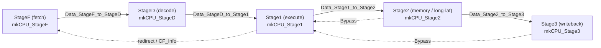
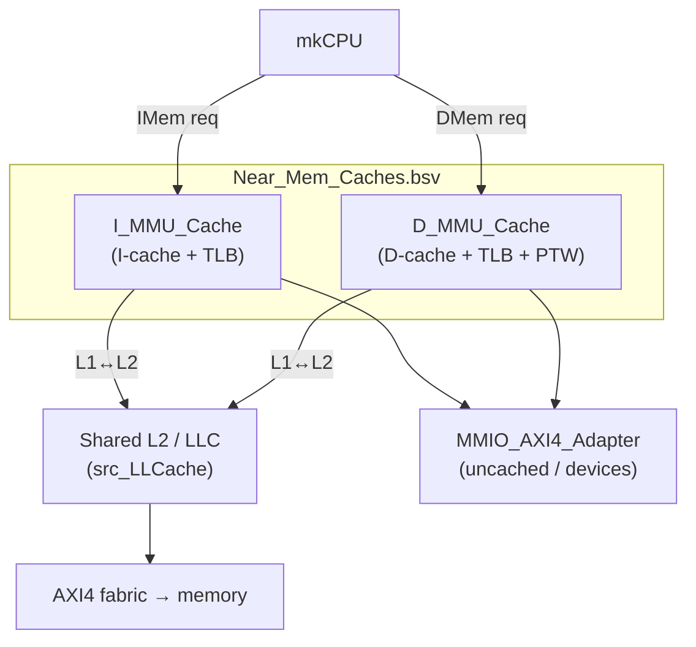

# 01 — The Base Flute Core (before STAR)

This chapter documents Flute **as it was at commit `c6f66da`**, before any STAR work.
Understanding it is a prerequisite for every later chapter: STAR does not replace this
machine, it threads tag logic *through* it. Everything here is stock CTSRD/Bluespec
Flute (authors: Rishiyur Nikhil et al.).

> There is an existing microarchitecture doc in
> [`Doc/Microarchitecture/`](../Microarchitecture/Microarchitecture.pdf) with SVG/PNG
> figures (`Fig_100`…`Fig_600`) drawn by the base-Flute authors. Those are the
> **authoritative** drawings of the base machine, so this chapter **reuses them** (linked
> below) and annotates where STAR hooks in, rather than redrawing a lower-fidelity copy.

### Base-Flute reference figures (in this repo)

| Figure | Shows | STAR relevance |
|---|---|---|
| [`Fig_100_Top_HW_Side`](../Microarchitecture/Figures/Fig_100_Top_HW_Side.png) | top HW: `mkSoC_Top` + memory model | unchanged |
| [`Fig_200_SoC_Top`](../Microarchitecture/Figures/Fig_200_SoC_Top.png) | SoC: AXI4 fabric, boot ROM, UART, `mkCore` | unchanged |
| [`Fig_300_mkCore`](../Microarchitecture/Figures/Fig_300_mkCore.png) / [`Fig_310_mkCore_v2`](../Microarchitecture/Figures/Fig_310_mkCore_v2.png) | core wrapper (`_v2` = the WB_L1_L2 wrapper STAR uses) | wrapper unchanged |
| [`Fig_500_mkCPU_Flute`](../Microarchitecture/Figures/Fig_500_mkCPU_Flute.png) | **the 5-stage CPU + regfiles + near_mem** | **primary STAR canvas** — see overlay below |
| [`Fig_600_Near_Mem_VM_WB_L1_L2`](../Microarchitecture/Figures/Fig_600_Near_Mem_VM_WB_L1_L2.png) | the WB_L1_L2 memory hierarchy | STAR adds the DT-cache as a 3rd L1 child |

**`Fig_500_mkCPU_Flute` — the base CPU, with STAR overlays marked:**


Read that figure with these STAR additions in mind (each detailed in a later chapter):

| Base block in Fig_500 | STAR adds alongside it | Chapter |
|---|---|---|
| `mkGPR_RegFile`, `mkFPR_RegFile` | `mkGPR_TAG_RegFile`, `mkFPR_TAG_RegFile`, `mkTPRF_RegFile` | [05](05-tag-regfiles.md) |
| `stageF … stage3` | the same 5 stages, each carrying/checking tags (TPP) | [06](06-pipeline-integration.md), [07](07-cfi-and-pointer-integrity.md) |
| `near_mem` → `icache`, `dcache` | a 3rd `mkMMU_Cache`-style child: the **DT-cache** | [04](04-dtcache-and-tlb.md) |
| `icache` (`mkMMU_Cache`) | its cache becomes `mkICache` (reads inline tag on port B) | [03](03-icache-inline-tag.md) |

---

## 1.1 What Flute is

- **RV64GC**, in-order, **5-stage** pipeline (also builds as RV32).
- Privilege modes M / S / U; Sv39 (RV64) or Sv32 (RV32) virtual memory.
- The STAR build uses the **`Near_Mem_VM_WB_L1_L2`** memory system: split write-back L1
  I/D caches plus a shared L2 (LLC), with per-cache TLBs and a page-table walker.

The top-level identity is described in `README.adoc` (core options at lines ~17–59).

---

## 1.2 Directory tree (the parts that matter)

```
src_Core/
├── CPU/                        # the 5-stage pipeline
│   ├── CPU.bsv                 #   mkCPU — instantiates stages + regfiles + near-mem
│   ├── CPU_StageF.bsv          #   Fetch
│   ├── CPU_StageD.bsv          #   Decode
│   ├── CPU_Stage1.bsv          #   Execute / ALU / branch resolve
│   ├── CPU_Stage2.bsv          #   Memory + long-latency (M-div, FP)
│   ├── CPU_Stage3.bsv          #   Writeback
│   ├── CPU_Globals.bsv         #   inter-stage register structs, Bypass structs, enums
│   ├── EX_ALU_functions.bsv    #   combinational ALU + address/branch computation
│   └── Branch_Predictor.bsv    #   BTB + RAS next-PC prediction
├── ISA/
│   ├── ISA_Decls.bsv           #   XLEN, opcodes, field extractors, priv modes
│   ├── ISA_Decls_Priv_M.bsv    #   M-mode CSRs + exception codes
│   └── ISA_Decls_Priv_S.bsv    #   S-mode CSRs
├── RegFiles/
│   ├── GPR_RegFile.bsv         #   32× integer registers
│   ├── FPR_RegFile.bsv         #   32× FP registers (ISA_F/D)
│   └── CSR_RegFile_MSU.bsv     #   control/status registers (M/S/U)
├── Near_Mem_VM_WB_L1_L2/       # ← the STAR near-memory config
│   ├── Near_Mem_Caches.bsv     #   glue: instantiates I/D caches + L2, exposes ports
│   ├── Near_Mem_IFC.bsv        #   CPU-facing IMem/DMem interfaces
│   ├── I_MMU_Cache.bsv         #   I-side: cache + MMU/TLB
│   ├── D_MMU_Cache.bsv         #   D-side: cache + MMU/TLB + page-table walker
│   ├── Cache.bsv               #   the generic set-associative WB cache
│   ├── TLB.bsv                 #   3-level TLB (gigapage/megapage/page)
│   ├── PTW.bsv                 #   hardware page-table walker
│   ├── MMIO_AXI4_Adapter.bsv   #   uncached / MMIO path
│   └── src_LLCache/            #   the shared L2 (LLC) + coherence
├── Near_Mem_VM_WB_L1/          # alternate: WB L1, no L2   (NOT the STAR config)
├── Near_Mem_VM_WT_L1/          # alternate: WT L1, no L2   (NOT the STAR config)
├── Core/ , Core_v2/            # SoC-facing wrappers (Core_v2 = the WB_L1_L2 wrapper)
├── PLIC/ , Near_Mem_IO/        # interrupt controller, CLINT (mtime/mtimecmp/msip)
└── Debug_Module/               # optional RISC-V debug module

src_Testbench/     # SoC top, AXI4 fabric, memory model (simulation)
src_bsc_lib_RTL/   # bsc runtime library (black-box Verilog)
src_SSITH_P2/      # DARPA SSITH wrapper + bsc-GENERATED Verilog_RTL (artifacts)
Tests/             # RISC-V ISA tests + elf_to_hex
Doc/               # microarchitecture doc + (this) STAR guide
builds/            # per-target build dirs (bluesim / verilator / iverilog)
```

---

## 1.3 The 5-stage pipeline

`mkCPU` (`CPU/CPU.bsv`) instantiates the five stages and connects them with the
inter-stage structs from `CPU_Globals.bsv`. Each stage exposes the same shape of
interface: `enq()` (accept the previous stage's packet), `out()` (produce its output +
next packet), `deq()`.



| Stage | Module (`file:line`) | Role |
|---|---|---|
| **F** Fetch | `CPU_StageF.bsv:71` `mkCPU_StageF` | Drives the I-cache via the branch predictor; produces the fetched instruction + predicted next PC. |
| **D** Decode | `CPU_StageD.bsv:65` `mkCPU_StageD` | Decodes the 32-bit instruction (expands 16-bit compressed if `ISA_C`) into a `Decoded_Instr`. |
| **1** Execute | `CPU_Stage1.bsv:76` `mkCPU_Stage1` | Reads GPRs (with bypass), runs the ALU (`EX_ALU_functions.bsv`), resolves branches/jumps, detects mispredicts and redirects StageF. Dispatches LD/ST/M/FP to Stage2. |
| **2** Memory | `CPU_Stage2.bsv:93` `mkCPU_Stage2` | Data-memory ops (LD/ST/AMO), the M-box (mul/div), the FP box. Manages long-latency stalls; produces `Bypass` back to Stage1. |
| **3** Writeback | `CPU_Stage3.bsv:80` `mkCPU_Stage3` | Writes the GPR/FPR result, updates `minstret`, emits the Tandem-Verification trace. |

### Inter-stage register structs (`CPU_Globals.bsv`)

These are the pipeline "latches." (Line numbers are the current tree; STAR added tag
fields to each — those are called out in [06](06-pipeline-integration.md). The base
fields are listed here.)

- `Data_StageF_to_StageD` (`:330`) — `pc, epoch, priv, is_i32_not_i16, exc, exc_code, tval, instr, pred_pc`
- `Data_StageD_to_Stage1` (`:388`) — the above minus prediction internals, plus `instr_C`, `decoded_instr`
- `Data_Stage1_to_Stage2` (`:516`) — `priv, pc, instr, op_stage2, rd, addr, val1, val2, …` (+ ISA_F operands)
- `Data_Stage2_to_Stage3` (`:613`) — `pc, instr, priv, rd_valid, rd, rd_val, …` (+ ISA_F)

### Bypass / forwarding

Because register reads happen in Stage1 but writes complete in Stage3, results are
forwarded back:

- `Bypass` (`CPU_Globals.bsv:119`) — `{ bypass_state, rd, rd_val }`, the classic GPR
  forward from Stage2/Stage3 into Stage1. `Bypass_State` ∈
  `{BYPASS_RD_NONE, BYPASS_RD, BYPASS_RD_RDVAL}` distinguishes "result not ready" from
  "result present."
- `FBypass` (`:167`) — the FP equivalent.

STAR adds parallel `Bypass_Tag` / `Bypass_TPRF` / `Bypass_LBL` channels alongside these;
see [06](06-pipeline-integration.md).

### Control-flow feedback

`Output_Stage1` carries a `Control` enum (`CPU_Globals.bsv:427`) —
`CONTROL_STRAIGHT / BRANCH / … / CONTROL_TRAP` — and a `CF_Info` struct (`:68`,
`{ cf_op, from_PC, taken, fallthru_PC, taken_PC }`) fed back to StageF to redirect the
pipeline and train the predictor. **STAR reuses `CONTROL_TRAP`**: a tag violation sets
`control = CONTROL_TRAP` exactly like an illegal-instruction trap.

---

## 1.4 Register files

`src_Core/RegFiles/`. All three follow the same pattern: a `RegFile` primitive plus a
`Server #(Token, Token)` reset interface.

**`GPR_RegFile.bsv`** — interface `GPR_RegFile_IFC` (`:33`):

```bsv
method Word read_rs1 (RegName rs1);          // read port 1
method Word read_rs1_port2 (RegName rs1);    // read port 2 — debugger only
method Word read_rs2 (RegName rs2);          // read port 2
method Action write_rd (RegName rd, Word rd_val);   // rd==0 is a NOP
interface Server reset;
```

Storage: `RegFile #(RegName, Word)` = 32 × XLEN (`:69`). `x0` reads as 0; writes to `x0`
are dropped.

**`FPR_RegFile.bsv`** (ISA_F/D) — like GPR but `WordFL` wide, with a **third** read port
`read_rs3` for fused multiply-add, and no `x0` special case.

STAR shadows both of these with **tag** register files of the same shape
(`GPR_TAG_RegFile` / `FPR_TAG_RegFile`, [chapter 05](05-tag-regfiles.md)), plus the new
`TPRF_RegFile` for CFI state.

---

## 1.5 The WB_L1_L2 memory hierarchy



- **`Near_Mem_Caches.bsv`** is the glue module: it instantiates `I_MMU_Cache`,
  `D_MMU_Cache`, connects them to the L2 interconnect (L1 child #0 = I, #1 = D) and the
  MMIO adapter, and exposes the CPU-facing `IMem`/`DMem` ports (`Near_Mem_IFC.bsv`).
- **`I_MMU_Cache` / `D_MMU_Cache`** each wrap the generic `Cache.bsv` with a TLB and
  address translation. The **D-side owns the page-table walker** (`PTW.bsv`); the I-side
  requests walks from it.
- **L2 / LLC** (`src_LLCache/`) is a MESI-coherent shared cache serving the L1 children.

> STAR adds a **third L1 child** — the DT-cache — to exactly this structure
> (L1 child #2, MMIO client #2), and makes it share the D-side's page-table walker. That
> is the subject of [chapter 04](04-dtcache-and-tlb.md).

### TLB sizing (`TLB.bsv`, Sv39 RV64)

Three hierarchical direct-mapped sub-TLBs, all probed concurrently:

| Sub-TLB | Covers | Entries | `file:line` |
|---|---|---|---|
| `TLB2` | gigapages (level 2) | **4** | `TLB.bsv:203` |
| `TLB1` | megapages (level 1) | **8** | `TLB.bsv:215` |
| `TLB0` | 4 KiB pages (level 0) | **16** | `TLB.bsv:227` |

Total **28** entries per TLB. Each cache (I, D — and STAR's DT) has its own TLB. A
`ma_flush` clears all entries in one cycle (`:353`).

> The dissertation's headline "TLB capacity is the decisive knob" finding is about
> *doubling these counts*; this is the base sizing STAR starts from.

### Page-table walker (`PTW.bsv`)

`PTW_IFC` takes `PTW_Req { va, satp }` and returns
`PTW_Rsp { result, pte, level, pte_pa }` where `result ∈ { PTW_OK, PTW_ACCESS_FAULT,
PTW_PAGE_FAULT }`. It walks 3 levels (Sv39) / 2 levels (Sv32), supports super-pages, and
inserts successful translations into the TLB. **STAR adds a `PTW_DCACHE_FAULT` sentinel
and a DT-cache request channel here** — see [chapter 04](04-dtcache-and-tlb.md).

---

## 1.6 ISA fundamentals (`ISA_Decls.bsv`)

The base typedefs STAR builds on:

```bsv
typedef 64 XLEN;                 // (RV64; 32 for RV32)
typedef Bit #(XLEN)  WordXL;     // register data / address
typedef Bit #(32)    Instr;
typedef Bit #(7)     Opcode;     // instr[6:0]
typedef Bit #(5)     RegName;    // 0..31

function Opcode  instr_opcode (Instr x) = x[6:0];
function Bit#(3) instr_funct3 (Instr x) = x[14:12];
function RegName instr_rd     (Instr x) = x[11:7];
function RegName instr_rs1    (Instr x) = x[19:15];
function RegName instr_rs2    (Instr x) = x[24:20];

typedef Bit #(2) Priv_Mode;      // u=00, s=01, m=11
```

Base exception codes and CSRs live in `ISA_Decls_Priv_M.bsv` / `_Priv_S.bsv`. STAR
widens `Exc_Code` to 5 bits and adds two codes + two S-mode CSRs there
([chapter 02](02-isa-and-tags.md)).

---

## 1.7 Where STAR hooks in — a preview

| Base mechanism | STAR hook | Chapter |
|---|---|---|
| I-cache fetch | 2nd BRAM port reads the inline itag; StageF skips the tag slot | [03](03-icache-inline-tag.md) |
| D-cache / PTW / LLC | a parallel DT-cache (L1 child #2) sharing the D-side walker | [04](04-dtcache-and-tlb.md) |
| GPR/FPR files | shadow TAG regfiles + the TPRF for CFI state | [05](05-tag-regfiles.md) |
| Pipeline structs + bypass | tag fields + `Bypass_Tag`/`_TPRF`/`_LBL` channels | [06](06-pipeline-integration.md) |
| EX / Stage1 / Stage2 / Stage3 | rank resolution, CFI FSM, memory checks, tag writeback | [06](06-pipeline-integration.md), [07](07-cfi-and-pointer-integrity.md) |
| `CONTROL_TRAP` + CSRs | `excep_CFI`/`excep_RAP` + TSRF reporting CSRs | [02](02-isa-and-tags.md), [07](07-cfi-and-pointer-integrity.md) |
