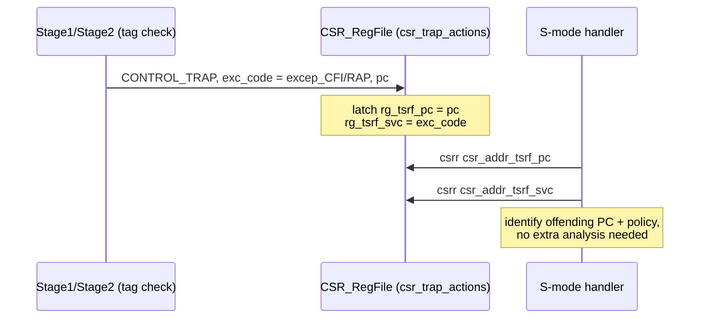

# 02 — ISA Layer: Tag Encodings, New Instructions, Exceptions, CSRs

This is the **encoding reference** for STAR. Almost everything here lives in
`src_Core/ISA/ISA_Decls.bsv`, with a few pieces in `ISA_Decls_Priv_M.bsv`,
`ISA_Decls_Priv_S.bsv`, and `RegFiles/CSR_RegFile_MSU.bsv`. Every constant below is
quoted from the current tree with its `file:line`.

---

## 2.1 The two tag namespaces

STAR has **two independent tag namespaces**. Do not confuse them:

| | Instruction tag (**itag**) | Data tag (**dtag**) |
|---|---|---|
| Attached to | an *instruction* | a *data word* (in memory or a register) |
| Width | 8-bit field, **6 meaningful bits** | **2 bits per 32-bit word** (stored 4-bit for a 64-bit slot) |
| Set by | the compiler, inline in the code stream | produced/checked by pointer-integrity policy |
| Carried in | pipeline structs (`Bit#(8) tag`) | TRF (registers) + DT-cache (memory) |
| Values | `op / CLR / target` fields (below) | `DT / DP / CP / RA` |

---

## 2.2 Instruction tags (itag) — `ISA_Decls.bsv:449–499`

Since commit `e75cb8d`, the itag is a **structured 6-bit bit-field** carried in a
`Bit#(8)`. A single instruction can combine fields (a "combined tag"): the hardware
decodes each field and applies each policy independently.

```
 bit:  7  6  5  4  3  2  1  0
       ┌──┬──┬─────┬──┬────────┐
       │ 0│ 0│ tgt │CLR│  op   │
       └──┴──┴─────┴──┴────────┘
              5:4   3    2:0
```

### Operation field `tag[2:0]` (`:458`)

| Const | Val | Meaning |
|---|---|---|
| `op_GEN` | 0 | Generic (default; indirect jumps are GEN + a JALR opcode) |
| `op_DPO` | 1 | Data-pointer-producing op |
| `op_CPO` | 2 | Code-pointer-producing op |
| `op_RAP` | 3 | Return-address protected (mem op that must touch an `[RA]` word) |
| `op_CAL` | 4 | Function call |
| `op_RET` | 5 | Function return |
| `op_EQR` | 6 | Equal-to-return (reserved) |
| `op_LBL` | 7 | Standalone CFI-label NOP |

### CLR modifier `tag[3]` (`:468`)

`clr_SET = 1'b1`. Valid only with memory ops (GEN/DPO/CPO/RAP). Enforces the
**single-copy invariant**: after a tagged value is moved, its source copy's tag is
scrubbed to `[DT]`. See [chapter 08](08-context-switch.md).

### Control-transfer target field `tag[5:4]` (`:471`)

| Const | Val | Marks a legal target of… |
|---|---|---|
| `tgt_NONE` | 0 | — (not a landing pad) |
| `tgt_TFC` | 1 | a function **call** |
| `tgt_TFR` | 2 | a function **return** |
| `tgt_TIJ` | 3 | an **indirect jump** |

### Field extractors (`:477`) — this is how the pipeline reads a tag

```bsv
function Bit #(3) itag_op     (Bit #(8) t) = t[2:0];
function Bool     itag_is_clr (Bit #(8) t) = (t[3] == clr_SET);
function Bit #(2) itag_target (Bit #(8) t) = t[5:4];
```

> **Design note.** The older (pre-`e75cb8d`) encoding was a flat enum with a standalone
> `itag_IDJ` (=9) and `itag_CLR`. Those are gone: indirect jump is now `op_GEN` inferred
> from the JALR opcode, and CLR is the `tag[3]` bit. This resolved the "13th tag"
> code-vs-dissertation discrepancy. Named convenience values still exist —
> `itag_GEN`..`itag_LBL` (`:482`), the bare landing pads `itag_TFC=0x10 / itag_TFR=0x20 /
> itag_TIJ=0x30` (`:493`), and common combined values `itag_RAP_CLR=0x0B` (`:498`,
> normal return-address push/pop) and `itag_TFC_DPO=0x11` (`:499`, call-target prologue
> SP-adjust).

---

## 2.3 Data tags (dtag) — `ISA_Decls.bsv:504–510`

```bsv
Bit #(4) dtag_DT = 4'b0000;   // rank 0 -- plain data
Bit #(4) dtag_DP = 4'b0001;   // rank 1 -- data pointer
Bit #(4) dtag_CP = 4'b0010;   // rank 2 -- code pointer
Bit #(4) dtag_RA = 4'b0011;   // rank 3 -- return address
```

**Encoding value == rank.** The ordering `DT(0) < DP(1) < CP(2) < RA(3)` is what the
EX-stage MIN/MAX resolution ([chapter 06](06-pipeline-integration.md)) compares directly.

> **The "2-bit vs 4-bit" question, settled.** The *architectural* data tag is **2 bits
> per 32-bit word**. The `Bit#(4)` you see everywhere holds **two** such 2-bit word-tags,
> because a 64-bit datapath element (e.g. a pointer) spans two 32-bit words and stores the
> same 2-bit tag in both. So a register's / slot's stored tag is 2 × 2-bit = 4 bits. Both
> statements are true; there is no contradiction.

> **History.** Commit `8aa5e13` (2026) corrected a prior swap where `CP=1, DP=2` (giving
> `DT<CP<DP<RA`), which would have let a data pointer outrank a code pointer. All hardware
> uses the symbolic `dtag_*` names, so the fix was confined to these four lines.

---

## 2.4 The inline tag container

Instruction tags are not a new instruction field — RV64 instructions have no spare bits.
Instead the compiler **interleaves a tag container into the code stream**, 16-byte
aligned, and the hardware steps over it.

- The container is a `LUI x0, imm` (writes nothing — `x0` is hardwired) whose 20-bit
  immediate carries the tag payload.
- One 16-byte line = one container word + up to three real instructions; the container
  packs **one 8-bit itag per 4-byte instruction slot**.
- **CFI label containers** carry a **20-bit** payload = **1 type bit + 19-bit function
  signature** (widened 18→19 in commit `04a5327` to match the S&P 2023 paper; the 19-bit
  signature lands in TPRF entry-1 bits `[21:3]`).

How the I-cache extracts a slot's tag, and how fetch/branch-predict skip the container,
is [chapter 03](03-icache-inline-tag.md). The alignment gate used at fetch is
(`CPU_StageF.bsv:148`):

```bsv
if (pc[3:0] == 0 && priv == 0 && pc < 'h_0015_5555_6000)  // land on a tag slot, user code
   pc = pc + 4;                                            // step over the 4-byte container
```

---

## 2.5 New instructions — context save/restore & TAG

`ISA_Decls.bsv:418–446`. These support tagging and context switching.

| Instruction | Opcode | funct3 | Semantics |
|---|---|---|---|
| `op_LOAD_CONTEXT` | `7'b01_010_10` (`:424`) | `f3_ctx_TRF=000` / `f3_ctx_TPRF=001` (`:436`) | Restore a tag-state entry from memory into the TRF or TPRF |
| `op_STORE_CONTEXT` | `7'b01_010_11` (`:430`) | same funct3 selector | Save a TRF or TPRF entry to memory |
| `op_TAG` | `7'b00_010_11` (`:446`) | — | Install a data tag into a register's TRF entry |

The **funct3 selects which tag file** the context op targets:

- `f3_ctx_TRF` (000) → a register's 4-bit **data tag** (TRF)
- `f3_ctx_TPRF` (001) → a **TPP-state** entry (CFI latch + label)

Both files must be saved/restored across a context switch — see
[chapter 08](08-context-switch.md) for why the DT-cache path alone is insufficient.

---

## 2.6 HARD exceptions — `ISA_Decls_Priv_M.bsv`

`Exc_Code` is widened to **5 bits** (`:541`, was 4) to make room for two STAR codes:

| Const | Val | Raised when |
|---|---|---|
| `excep_CFI` | **16** | a CFI/label/target check fails (bad call target, label mismatch, bad indirect-jump target, forged code pointer) |
| `excep_RAP` | **17** | a return-address-protection check fails (return doesn't consume `[RA]`, `[GEN]` op consumes `[RA]`, mem op mismatches `[RA]`) |

Both are delivered through the *existing* trap machinery: the offending stage sets
`control = CONTROL_TRAP` and `exc_code = excep_CFI|excep_RAP`, and the CPU traps exactly
like any synchronous exception.

---

## 2.7 TSRF reporting CSRs — `ISA_Decls_Priv_S.bsv` + `CSR_RegFile_MSU.bsv`

So the S-mode handler can identify *what* fired and *where*, STAR adds two S-mode custom
CSRs:

| CSR | Addr | Holds |
|---|---|---|
| `csr_addr_tsrf_pc` | `0x5C1` (`ISA_Decls_Priv_S.bsv:40`) | the offending instruction's PC |
| `csr_addr_tsrf_svc` | `0x5C2` (`ISA_Decls_Priv_S.bsv:41`) | the security violation code (which policy) |

They are latched automatically on a security trap. In `CSR_RegFile_MSU.bsv`,
`csr_trap_actions` does (≈`:1293`):

```bsv
// STAR: on a security exception (CFI/RAP), latch the offending PC + violation code.
if ((! interrupt) && ((exc_code == excep_CFI) || (exc_code == excep_RAP))) begin
   rg_tsrf_pc  <= pc;
   rg_tsrf_svc <= zeroExtend (exc_code);
end
```

Storage `rg_tsrf_pc` / `rg_tsrf_svc` (`:329`), read plumbing (`:678`), write plumbing
(`:878`), existence registration (`:544`).



> **History.** A third CSR `csr_addr_tsrf_latch` (`0x5C0`) once held the CFI latch, but
> commit `b6f2fa2` dropped it — the latch is now saved/restored via
> `STORE_CONTEXT`/`LOAD_CONTEXT` against the TPRF ([chapter 08](08-context-switch.md)).

---

## 2.8 CFI target-check latch states — `ISA_Decls.bsv:518–522`

The 3-bit CFI latch armed by the Stage-1 state machine ([chapter 07](07-cfi-and-pointer-integrity.md)):

| State | Val | Armed by → expects next instr to carry |
|---|---|---|
| idle | 0 | (nothing armed) |
| `cfi_TCHK_CAL` | 1 | a `[CAL]` → next must be `tgt_TFC` |
| `cfi_TCHK_RET` | 2 | a `[RET]` → next must be `tgt_TFR` |
| `cfi_TCHK_LBL_SRC` | 3 | a source `[LBL]` → next must be a CFI op |
| `cfi_TCHK_LBL_CFI` | 4 | CFI op after a source label → next must be the matching dest `[LBL]` |
| `cfi_TCHK_IDJ` | 5 | an indirect jump (`[GEN]` JALR) → next must be `tgt_TIJ` |

This latch is what the TPRF stores (entry-1 bits `[2:0]`), so it survives context
switches.
