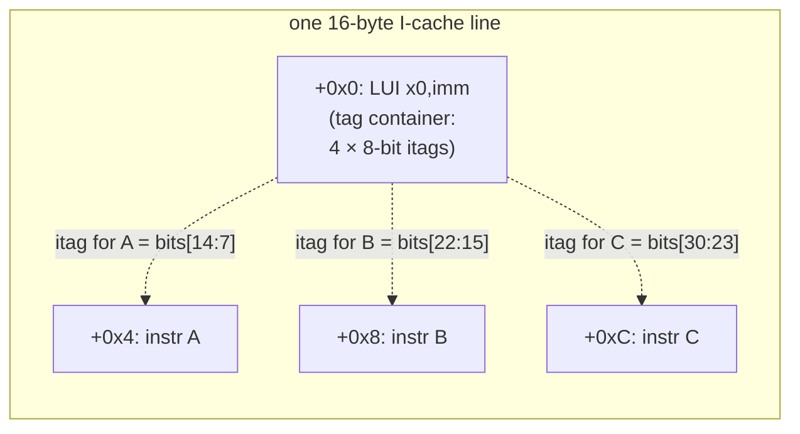
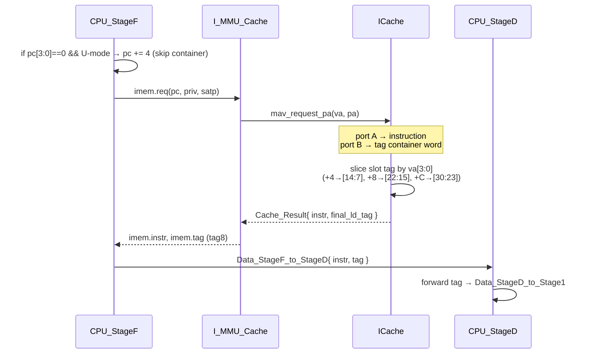

# 03 — Inline Instruction-Tag Fetch Path

This chapter follows one instruction and its inline tag from the I-cache to the decode
stage. The goal STAR achieves here: **fetch the 8-bit instruction tag "for free"
alongside the instruction, and make the tag container invisible to execution.**

Files: `Near_Mem_VM_WB_L1_L2/ICache.bsv` (new), `I_MMU_Cache.bsv`,
`CPU/CPU_StageF.bsv`, `CPU/CPU_StageD.bsv`, `CPU/Branch_Predictor.bsv`,
`Near_Mem_VM_WB_L1_L2/Near_Mem_IFC.bsv`.

---

## 3.1 The idea

RV64 instructions have no spare bits for a tag, so the compiler stores tags **inline**:
one 16-byte-aligned **tag container** (a `LUI x0, imm`) at the start of each 16-byte
line, packing one 8-bit tag per 4-byte instruction slot in that line.

Two things must happen in hardware:

1. **Read** the container's relevant 8-bit slot alongside the fetched instruction, and
   attach it to the pipeline packet.
2. **Skip** the container so it is never executed, and so branch prediction / next-PC
   don't stumble on it.



---

## 3.2 `ICache.bsv` — reading the tag on port B

`ICache.bsv` is a **copy of the generic `Cache.bsv`** (commit `b0dbd64`) specialized to
also return the inline tag. Its interface `ICache_IFC` mirrors the base cache
(`ma_request_va`, `mav_request_pa` → `Cache_Result`, flush server, L1↔L2 client), with
one addition: the result carries a tag.

**`Cache_Result` gains a tag field** (`ICache.bsv:59`):

```bsv
typedef struct {
   Cache_Result_Type  outcome;
   Bit #(64)          final_ld_val;
   Bit #(64)          final_st_val;
   Bit #(8)           final_ld_tag;   // STAR: inline instruction tag on a read hit
} Cache_Result deriving (Bits, FShow);
```

### The second BRAM port

The cache's data RAM (`ram_cset_cword`) is dual-ported. Port A serves the instruction
read as in base Flute. **STAR repurposes port B to read the tag container in parallel**
(`ICache.bsv:450`), except during a refill when port B is the write port:

```bsv
// STAR: also read the inline instruction-tag word alongside the data. Tags are
// line-aligned, so clear va[3:0]; use the cword RAM's 2nd port (B) for this read,
// except during a refill when port B serves as the write port.
let va_tag = va;
va_tag[3:0] = 0;                       // align to the 16-byte line start
if (rg_fsm_state != FSM_UPGRADE_REFILL) begin
   let cset_ctag_in_cache = fn_Addr_to_CSet_CWord_in_Cache (va_tag);
   ram_cset_cword.b.put (bram_cmd_read, cset_ctag_in_cache, ?);
end
```

The per-way hit selection then ORs in the tag word for the hitting way, exactly
mirroring the data-word path (`ICache.bsv:407,424`), producing `valid_info.tag`.

### Slicing the slot's 8-bit tag

On a load hit, the response path picks this instruction's tag out of the container word
by its offset within the line (`ICache.bsv:1204`):

```bsv
let tag_va = req.va;  tag_va[3:0] = 0;
let tag = fv_from_byte_lanes (zeroExtend (tag_va), req.f3[1:0], valid_info.tag);
tag = fv_extend (req.f3, tag);

if      (req.va[3:0] == 4) tag = tag[14:7];    // slot A (instr at +4)
else if (req.va[3:0] == 8) tag = tag[22:15];   // slot B (instr at +8)
else                       tag = tag[30:23];   // slot C (instr at +12)
```

The hit result then sets `final_ld_tag: tag` (`ICache.bsv:1252`). Stores and
non-instruction paths return `final_ld_tag: 0` (= `op_GEN`).

> The container is at offset `+0x0`, so the three *real* instruction slots are at
> `+4/+8/+C`; their tags occupy bit ranges `[14:7] / [22:15] / [30:23]` of the packed
> word. This is why fetch never lands the CPU on `+0x0` in user code (it skips it, §3.4).

---

## 3.3 `I_MMU_Cache.bsv` — carrying the tag out to the CPU

`I_MMU_Cache` is re-pointed from `mkCache` to `mkICache` (`I_MMU_Cache.bsv:77,211`) and
adds a register + method to surface the tag:

```bsv
// interface addition (:101)
(* always_ready *) method Bit #(8) tag8;      // instruction tag read inline

// latched from the cache result on a read hit (:245, :434)
Reg #(Bit #(8)) crg_ld_tag [2] <- mkCRegU (2);
crg_ld_tag[0] <= cache_result.final_ld_tag;

// returned to the CPU (:630)
method Bit #(8) tag8; return crg_ld_tag[0]; endmethod
```

MMIO / non-cached fetches carry no tag, so the tag defaults to 0 there
(`I_MMU_Cache.bsv:510`). The CPU-facing `IMem_IFC` exposes this as
`method Bit #(8) tag` (`Near_Mem_IFC.bsv:188`).

---

## 3.4 `CPU_StageF.bsv` — capture the tag, skip the container

`mkCPU_StageF` gains a `cur_priv` parameter (`CPU_StageF.bsv:71`) so it can apply the
tag logic **only in user mode** (the kernel runs untagged).

**Skip the container** (`:147`):

```bsv
// In user mode, tags sit on 16-byte boundaries; if the fetch PC lands on a tag
// slot within the user code region, advance past the 4-byte container.
if (pc[3:0] == 0 && priv == 0 && pc < 'h_0015_5555_6000)
   pc = pc + 4;
```

**Capture the tag** into the pipeline packet (`:113`):

```bsv
let d = Data_StageF_to_StageD { …, instr: imem.instr,
                                tag: imem.tag,        // STAR: inline itag → pipeline
                                pred_pc: pred_pc };
```

---

## 3.5 `CPU_StageD.bsv` — pass the tag through decode

Decode does not interpret the tag; it just forwards it (`CPU_StageD.bsv:77,115`):

```bsv
Bit #(8) tag = rg_data.tag;                 // carry unchanged
output_stageD.data_to_stage1 = Data_StageD_to_Stage1 { …, tag: tag, … };
```

From Stage1 onward the tag is decoded via `itag_op` / `itag_target` / `itag_is_clr`
([chapters 06](06-pipeline-integration.md)/[07](07-cfi-and-pointer-integrity.md)).

---

## 3.6 `Branch_Predictor.bsv` — privilege-aware next-PC

`predict_rsp` gains a `cur_priv` argument (`Branch_Predictor.bsv:52`) so the predictor's
fall-through PC can account for the tag container. The active fall-through is the normal
`rg_pc + (is_i32_not_i16 ? 4 : 2)`; the container-skip experiment in this method is
**present but commented out** (`:296`) — the actual skip is done by StageF (§3.4), and
BTB/RAS predictions are unaffected because compiler-emitted targets already point past
containers.

> **Continuation note.** If you revisit predictor accuracy, the commented block in
> `predict_rsp` was an attempt to also bump the *predicted* fall-through past a tag slot.
> It is disabled; StageF's `enq` skip is authoritative. Re-enabling it risks
> double-skipping — verify against StageF before touching it.

---

## 3.7 End-to-end



**Net effect:** every instruction reaches Stage1 with its 8-bit itag attached, at no
extra fetch cycles (the tag read is parallel on port B), and the tag container never
executes.
