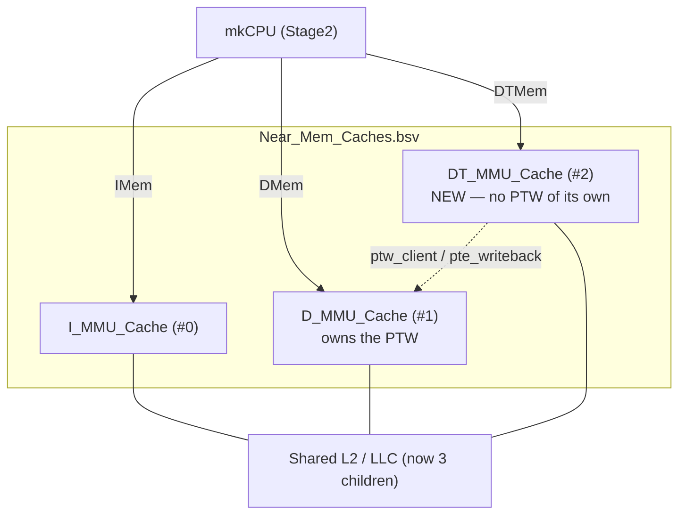
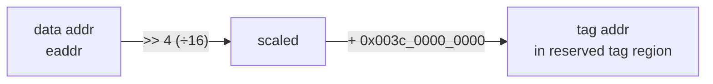
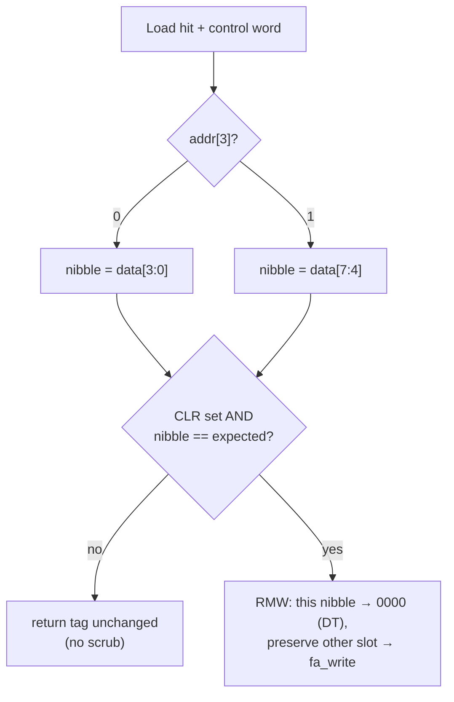
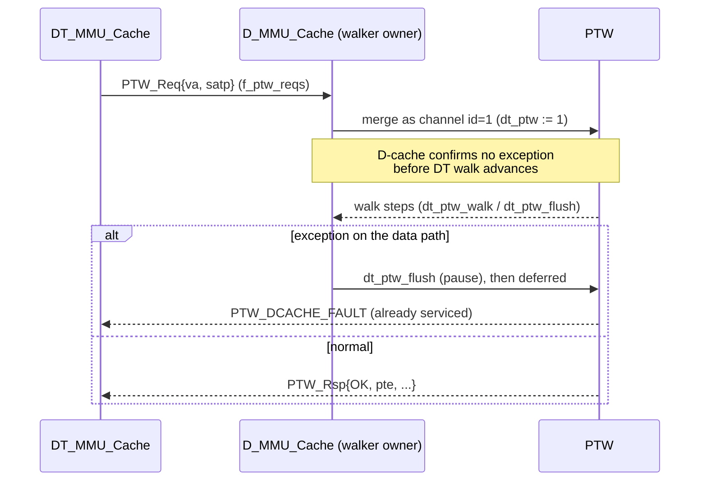

# 04 — Data-Tag Cache, DT-TLB, and the Shared Page-Table Walker

Where instruction tags come from the code stream ([chapter 03](03-icache-inline-tag.md)),
**data tags** describe every data word in memory. STAR stores them in a **third L1
cache** — the Data-Tag Cache (DT-cache) — living in a reserved tag-memory region and
addressed in lock-step with the D-cache.

Files: `Near_Mem_VM_WB_L1_L2/DTCache.bsv` (new), `DT_MMU_Cache.bsv` (new),
`D_MMU_Cache.bsv`, `PTW.bsv`, `Near_Mem_Caches.bsv`, `Near_Mem_IFC.bsv`,
`MMIO_AXI4_Adapter.bsv`, `src_LLCache/LLCache_Aux.bsv`. Tag-address computation is in
`CPU/EX_ALU_functions.bsv`; the access itself is in `CPU/CPU_Stage2.bsv`
([chapter 07](07-cfi-and-pointer-integrity.md)).

---

## 4.1 Where the DT-cache sits

The DT-cache is a peer of the I- and D-caches: **L1 child #2** on the L2 interconnect and
**MMIO client #2**. It runs in parallel with the D-cache on every user-mode load/store.

> The base memory hierarchy this extends is drawn (by the base-Flute authors) in
> [`Fig_600_Near_Mem_VM_WB_L1_L2`](../Microarchitecture/Figures/Fig_600_Near_Mem_VM_WB_L1_L2.png).
> STAR adds one more L1 child (the DT-cache) to that picture; everything else there is
> unchanged.



The counts had to grow to admit the new child:

- LLC child caches: 2 → **3** (`LLCache_Aux.bsv:55`, `L1Num = CoreNum*3 (+1 for DMA)`)
- MMIO clients: 2 → **4** (`MMIO_AXI4_Adapter.bsv:430`) — I(#0), D(#1), **DT(#2)**, DMA(#3)

The `DTMem_IFC` CPU-facing port (same request/response shape as `DMem_IFC`) is defined at
`Near_Mem_IFC.bsv:225` and wired through `Near_Mem_Caches.bsv:478`.

---

## 4.2 Tag-address mapping: data address → tag address

Every 16 bytes of data map to **one tag byte**. The mapping is a shift + a fixed base,
computed in EX for every load/store (`EX_ALU_functions.bsv:760` for LD, `:836` for ST):

```bsv
WordXL tag_eaddr = pack ((eaddr >> 4) + 'h_003c_0000_0000);
```



- `>> 4` — 16 data bytes → 1 tag byte (the 16:1 ratio of the upper-1/16 layout).
- `+ 0x003c_0000_0000` — the base of the reserved data-tag region.
- The tag request forces `f3 = 3'b000` (byte access) and is gated to user-mode data
  addresses `< 0x003c_0000_0000` so tag accesses never recurse into the tag region.

The computed `tag_addr` rides the pipeline structs from EX → Stage1 → Stage2
([chapter 06](06-pipeline-integration.md)) and is used as the DT-cache address.

---

## 4.3 Tag storage layout: nibble packing

Each DT-cache "data" byte holds **two 4-bit tags** — one per 64-bit data slot in the
16-byte window. `addr[3]` selects which slot:

```
 tag byte:  ┌───────────┬───────────┐
            │ slot B     │ slot A     │
            │ [7:4]      │ [3:0]      │
            └───────────┴───────────┘
            addr[3]==1   addr[3]==0
```

The read side selects the nibble in Stage2 (`CPU_Stage2.bsv:293`):

```bsv
Bit #(4) result_tag = (rg_stage2.addr[3] == 1'b0) ? dtcache.word64[3:0]
                                                   : dtcache.word64[7:4];
```

> **History / bug fix.** Before `3f7c56f`, the read always took the low nibble — so a
> load/store to the high slot validated the *wrong* tag. The `addr[3]` select fixed it.
> If you touch the nibble layout, this is the invariant to preserve: **`addr[3]` picks
> the slot on both read and RMW-write.**

---

## 4.4 `[CLR]` validate-then-scrub, in-cache

The `[CLR]` modifier ([chapter 02](02-isa-and-tags.md)) enforces the single-copy
invariant on a load: after a one-use tagged value (e.g. a return address) is loaded, its
**memory** copy's tag is scrubbed to `[DT]` — done *inside the DT-cache* as a
read-then-write RMW, without a second CPU round trip.

The load carries no store data, so Stage2 packs a **control word** into the DT store-value
field (`CPU_Stage2.bsv:774`):

```
 control word [3:0]:  { addr[3] , CLR , expected[1:0] }
                        nibble    tag[3]  per-op tag (RA/DP/CP/DT)
```

The DT-cache load-hit branch validates and conditionally scrubs (`DTCache.bsv:1199`):

```bsv
Bit #(4) acc_nibble = (req.st_value[3] == 1'b0) ? data[3:0] : data[7:4];
if ((req.st_value[2] == 1'b1)                              // CLR set
    && (acc_nibble == zeroExtend (req.st_value[1:0]))) begin  // and tag matches expected
   Bit #(8) newbyte = (req.st_value[3] == 1'b0) ? { data[7:4], 4'h0 }   // scrub slot A
                                                : { 4'h0, data[3:0] };  // scrub slot B
   fa_write (pa, req.f3, zeroExtend (newbyte));            // RMW, preserve the other slot
end
```



Mismatch → **no scrub** (and Stage2 raises the pointer-integrity violation separately).
The symmetric CLR-on-*store* scrubs the *source register's* TRF tag instead — that lives
in Stage3, [chapter 08](08-context-switch.md).

---

## 4.5 `DT_MMU_Cache.bsv` — a cache with no walker

`DT_MMU_Cache` is a **trimmed copy of `D_MMU_Cache`** that fronts the DTCache. Crucially
it has **no page-table walker of its own** — tag translations reuse the D-cache's walker.
It also drops the `tohost` (simulation pass/fail) machinery.

It exposes a `ptw_client` and a `pte_writeback` Get (`DT_MMU_Cache.bsv:714`), connected in
`Near_Mem_Caches.bsv:320` to the D-cache's `dtmem_ptw_server` / `dtmem_pte_writeback_p`.



---

## 4.6 `D_MMU_Cache.bsv` + `PTW.bsv` — the shared walker

The D-cache exposes its walker to the DT-cache and coordinates the two request streams so
they never interleave incorrectly.

**`D_MMU_Cache.bsv`:**
- New interfaces `dtmem_ptw_server` + `dtmem_pte_writeback_p` (`:133`).
- A `dequeue_dtmem_ptw` flag (`:290`) set when an exception aborts a DT-cache walk that
  shares this walker; rule `rl_ptw_deq_dt` (`:797`) drains that walk's deferred response.
- On a TLB hit it *advances* the in-flight DT walk (`ptw.dt_ptw_walk`, `:494`); on an
  exception it *aborts* it (`ptw.dt_ptw_flush`, `:445` and others).
- Normal PTW reads are blocked while a DT response is pending (`:722`) so the two streams
  don't interleave. PTE writebacks from I/D/DT are merged into one path (`:816`).

**`PTW.bsv`:**
- New `PTW_DCACHE_FAULT` result sentinel (`:61`) — "the shared walker already serviced
  this access on the data path."
- A separate `dtmem_server` (`:103`) and control hooks `dt_ptw_rsp_enq` / `dt_ptw_flush`
  / `dt_ptw_walk` / `dt_ptw_count` (`:111`).
- Merged request queue tagged by channel: **0 = DMem, 1 = DTMem, 2 = IMem** (`:155`; note
  the stale comment there — the dispatch code at `:233` is authoritative).
- `dt_ptw_rsp_enq` (`:514`) pops the merged request and pushes a synthetic
  `PTW_DCACHE_FAULT` on the DTMem channel.

> **The invariant to preserve:** the DT-cache must not start a page-table walk until the
> D-cache confirms the same access won't fault. This is why the walker is *shared* and
> gated, not duplicated — a duplicated walker could translate a tag address whose data
> address is about to page-fault.

---

## 4.7 Coherence & flushing

The DT-cache participates in L2 (MESI) coherence like any L1 child (registered at
`Near_Mem_Caches.bsv:344`), and its TLB is flushed together with the others on
`SFENCE.VMA` (`Near_Mem_Caches.bsv:553`, `dt_mmu_cache.tlb_flush`). No new coherence
protocol is introduced — the DT-cache is just a third participant.

---

## 4.8 Summary

| Aspect | Value / location |
|---|---|
| DT-cache config | same as D-cache (e.g. 8 KiB, set-assoc, WB) |
| Storage unit | 1 tag byte per 16 data bytes = two 4-bit slot tags |
| Slot select | `addr[3]` (read + RMW), `CPU_Stage2.bsv:293` |
| Tag address | `(data_addr >> 4) + 0x003c_0000_0000`, `EX_ALU_functions.bsv:760/836` |
| Access gated to | user mode, data addr `< 0x003c_0000_0000` |
| Page walks | delegated to D-cache; `PTW_DCACHE_FAULT` sentinel |
| L2 child / MMIO client | #2 in both |
| `[CLR]` scrub | in-cache RMW on load-hit, `DTCache.bsv:1199` |
