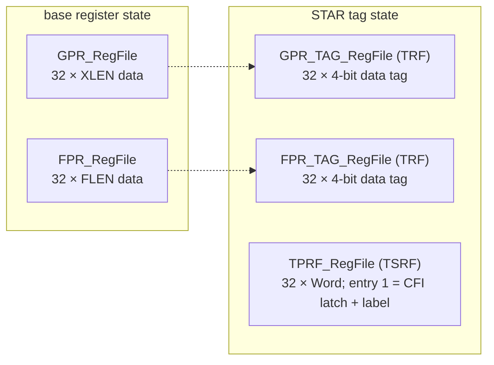
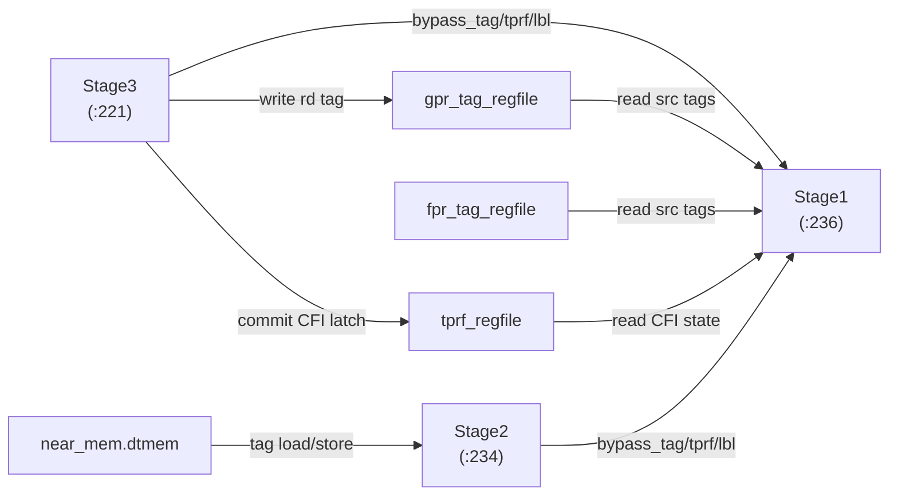

# 05 — Tag Register Files: TRF and TPRF

STAR adds three register files that shadow / augment the base register state. Two hold
**per-register data tags** (the TRF); one holds **per-thread CFI state** (the TPRF).
`CPU.bsv` instantiates all three and threads them into the pipeline stages.

Files: `RegFiles/GPR_TAG_RegFile.bsv`, `RegFiles/FPR_TAG_RegFile.bsv`,
`RegFiles/TPRF_RegFile.bsv` (all new), and `CPU/CPU.bsv` (wiring).

---

## 5.1 The three files at a glance



| File | Purpose | Entries × width | Save/restore selector |
|---|---|---|---|
| `GPR_TAG_RegFile` | data tag of each integer register | 32 × `Bit#(4)` | `f3_ctx_TRF` |
| `FPR_TAG_RegFile` | data tag of each FP register | 32 × `Bit#(4)` (in `WordFL` slots) | `f3_ctx_TRF` |
| `TPRF_RegFile` | CFI latch + active label (TPP state) | 32 × `Word` | `f3_ctx_TPRF` |

---

## 5.2 The TRF — `GPR_TAG_RegFile` / `FPR_TAG_RegFile`

Both are structurally identical to the base GPR/FPR files but return a **4-bit tag**
instead of data. `GPR_TAG_RegFile_IFC` (`GPR_TAG_RegFile.bsv:43`):

```bsv
interface GPR_TAG_RegFile_IFC;
   interface Server #(Token, Token) server_reset;
   method Bit #(4) read_rs1 (RegName rs1);
   method Bit #(4) read_rs1_port2 (RegName rs1);   // debugger only
   method Bit #(4) read_rs2 (RegName rs2);
   method Action   write_rd (RegName rd, Bit #(4) rd_val);
endinterface
```

- Storage: `RegFile #(RegName, Bit#(4))` (`:80`), 32 entries.
- `x0`'s tag is always `DT` (0); writes to `x0` are dropped — matching base GPR semantics.
- The FP variant (`FPR_TAG_RegFile.bsv`) adds a third read port `read_rs3` for FMA, and
  has no `x0` special case, again mirroring the base FPR file.
- Read ports mirror the base file's, so a source register's tag is read in the same cycle
  as its value in Stage1.

The TRF is written every cycle a register is written — Stage3 writes `rd`'s data value to
`GPR_RegFile` and `rd`'s **tag** to `GPR_TAG_RegFile` in the same commit
([chapter 06](06-pipeline-integration.md)).

---

## 5.3 The TPRF — `TPRF_RegFile`

The TPRF (a.k.a. TSRF, TPP State Register File) is a **32-entry `Word` file** holding the
tag-engine's control-flow state. **Entry 1 is special** and packs two things
(`TPRF_RegFile.bsv:6–14`):

```
 TPRF entry 1:  ┌──────────────────────────┬──────────┐
                │ label / signature [21:3] │ latch[2:0]│
                │  (19-bit function sig)   │ cfi_TCHK_*│
                └──────────────────────────┴──────────┘
```

Interface `TPRF_RegFile_IFC` (`:43`) — note the **two write ports**:

```bsv
method Word read_rs1 (RegName rs1);
method Word read_rs1_port2 (RegName rs1);           // debugger only
method Word read_rs2 (RegName rs2);
method Action write_rd  (RegName rd1, Word rd_val);        // CFI / status word
method Action write_rd2 (RegName rd2, Word rd_val_label);  // label word
```

Two write ports exist so CFI status and the label can be updated independently, but in
practice Stage3 packs both into one word and uses a single muxed write (commit `f7329f4`
packed status+label into one register to avoid two same-cycle writes; see
[chapter 07](07-cfi-and-pointer-integrity.md)). Entry 0 reads as 0 and its writes are
dropped.

The whole file is saved/restored on a context switch via `STORE_CONTEXT`/`LOAD_CONTEXT`
with `f3_ctx_TPRF` ([chapter 08](08-context-switch.md)).

---

## 5.4 Wiring in `CPU.bsv`

`mkCPU` instantiates the three files near the base regfiles:

```bsv
GPR_TAG_RegFile_IFC  gpr_tag_regfile  <- mkGPR_TAG_RegFile;   // :141
TPRF_RegFile_IFC     tprf_regfile     <- mkTPRF_RegFile;      // :142
`ifdef ISA_F
   FPR_TAG_RegFile_IFC fpr_tag_regfile <- mkFPR_TAG_RegFile;  // :146
`endif
```

They are threaded into the stages that read/write tags:



- **Stage1** (`:236`) gets *read* ports on all three, plus the bypass channels from
  Stage2 and Stage3 (`bypass_tag`, `bypass_tprf`, `bypass_lbl`, and FP variants).
- **Stage2** (`:234`) gets `near_mem.dtmem` for the parallel data-tag access.
- **Stage3** (`:221`) gets *write* ports on the TRF(s) and TPRF for commit.
- **StageF** (`:264`) gets `rg_cur_priv` for the inline-tag skip.

---

## 5.5 Reset — a caveat to preserve

The reset handshake in `mkCPU` (`rl_reset_start` at `:485`, `rl_reset_complete` at `:528`)
requests and collects reset for `gpr_regfile`, `gpr_tag_regfile`, `fpr_regfile`,
`fpr_tag_regfile`, `csr_regfile`, `near_mem`, and all five stages — but **not**
`tprf_regfile`.

- **Impact:** the TPRF is not explicitly zeroed at reset like the other regfiles are.
  Because the per-instruction CFI-latch commit in Stage3 is gated to user mode and the
  kernel boots in M/S mode, entry 1 is written before the first user instruction relies
  on it in the common boot path — so this has not manifested as a failure. But it is an
  **inconsistency with the other regfiles**, and reset determinism (esp. for
  tandem-verification) would want the TPRF reset added alongside `gpr_tag_regfile` at
  `:486` / `:529`.
- **Status:** noted, not "fixed." Confirm against a `bsc` build before changing reset
  behavior — the other regfiles' reset uses a FIFO-backed `Server` handshake the stages
  wait on, so adding the TPRF means adding both the request (`:486`) and the response
  collection (`:529`).

> This is exactly the kind of thing this doc exists to flag for whoever continues the
> work: it is real, it is low-risk today, and it is trivially closeable — but do it with
> a build in the loop, not blind.
