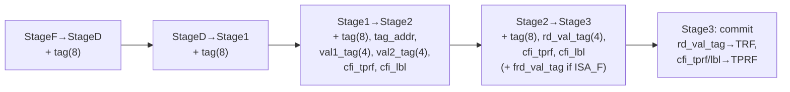
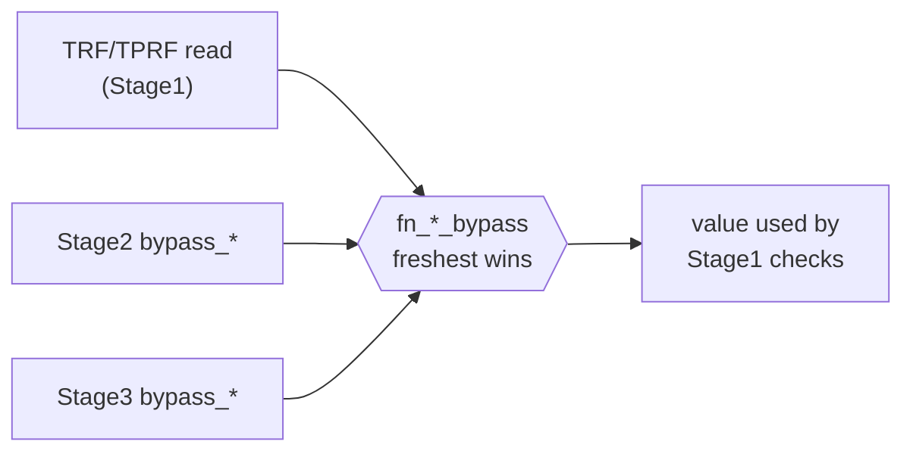
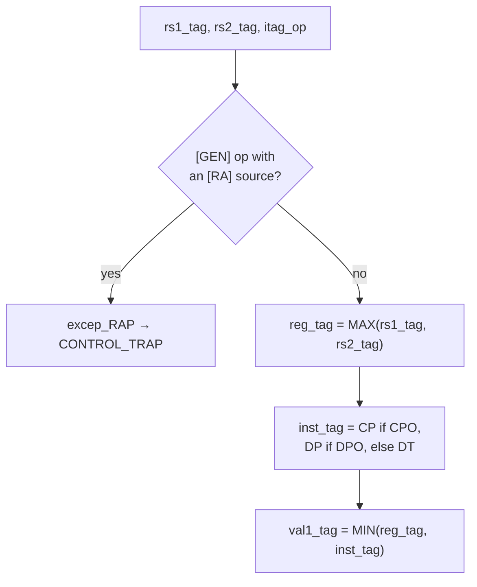
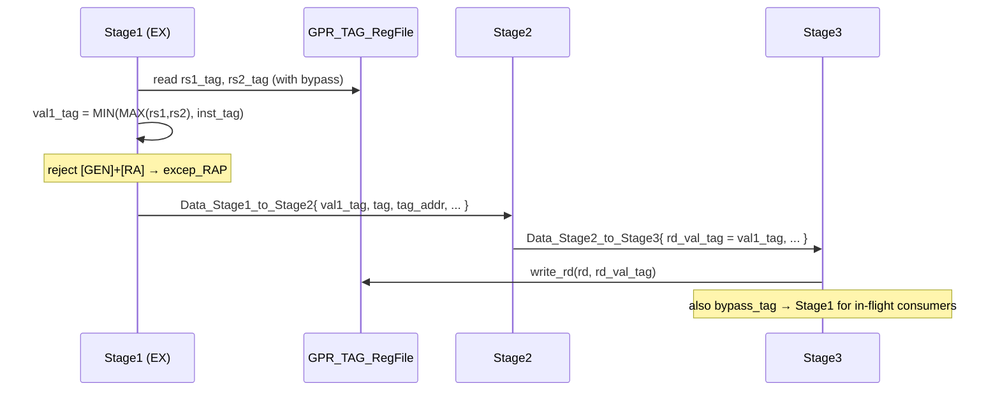

# 06 — Pipeline Integration: Tag Fields, Bypass, Rank Resolution

This chapter is the "plumbing" chapter: how tags ride the pipeline structs, how they are
forwarded (bypassed) back to Stage1, and the **rank-based destination-tag resolution** in
EX. The per-policy *checks* built on top of this live in
[chapter 07](07-cfi-and-pointer-integrity.md).

Files: `CPU/CPU_Globals.bsv` (structs + bypass), `CPU/EX_ALU_functions.bsv` (rank
resolution + tag-address + per-tag production), and the per-stage carriers.

---

## 6.1 What travels where

Each pipeline latch gained tag fields. The 8-bit **instruction tag** rides all the way
from fetch; the 4-bit **data tags**, the **tag address**, and the **CFI status/label**
join at the appropriate stage.



Exact fields (`CPU_Globals.bsv`):

| Struct | New fields | Lines |
|---|---|---|
| `Data_StageF_to_StageD` | `Bit#(8) tag` | `:341` |
| `Data_StageD_to_Stage1` | `Bit#(8) tag` | `:522` (in-struct) |
| `Data_Stage1_to_Stage2` | `Bit#(8) tag`, `Addr tag_addr`, `Bit#(4) val1_tag`, `Bit#(4) val2_tag`, `WordXL cfi_tprf`, `WordXL cfi_lbl` | `:522,529,532,535,536,537` |
| `Data_Stage2_to_Stage3` | `Bit#(8) tag`, `Bit#(4) rd_val_tag`, `WordXL cfi_tprf`, `WordXL cfi_lbl`, (`Bit#(4) frd_val_tag` if ISA_F) | `:616,622,623,624,631` |

- `tag` — the inline instruction tag ([ch 03](03-icache-inline-tag.md)).
- `tag_addr` — the DT-cache address `(eaddr>>4)+0x003c_0000_0000` ([ch 04](04-dtcache-and-tlb.md)).
- `val1_tag` / `val2_tag` — the data tags of source operands rs1 / rs2 (read from the TRF).
- `rd_val_tag` — the destination register's resolved data tag, to be committed.
- `cfi_tprf` / `cfi_lbl` — the CFI latch/status word and the label, to be committed to the TPRF.

---

## 6.2 Bypass / forwarding of tag state

Register (and tag) reads happen in Stage1, but the producing instruction may still be in
Stage2/Stage3. STAR mirrors the base `Bypass` mechanism with three parallel channels
(`CPU_Globals.bsv`):

| Channel | Carries | Struct (`line`) |
|---|---|---|
| `Bypass_Tag` | a 4-bit data tag (register nibble) | `:129` |
| `Bypass_TPRF` | the packed CFI/TPP status word | `:138` |
| `Bypass_LBL` | the in-flight CFI label | `:145` |
| `FBypass_Tag` | FP data tag (ISA_F) | `:174` |

Each has a matching resolver function, e.g. `fn_tag_bypass` (`:242`) selects the freshest
value: if a later stage is producing `rd`, take its forwarded tag; else use the regfile
read. Stage1 chains Stage3-then-Stage2 bypass so the **most recent** producer wins
([chapter 07 §7.1](07-cfi-and-pointer-integrity.md) shows the CFI/label chaining).



---

## 6.3 Rank-based destination-tag resolution (`EX_ALU_functions.bsv:1414`)

The core arithmetic tag rule from the S&P 2023 paper / Ch3:

```
RANK(out) = MIN( MAX(RANK(rs1), RANK(rs2)), RANK(instruction-implied) )
```

Because **encoding value == rank** (`DT=0 < DP=1 < CP=2 < RA=3`), MAX/MIN are ordinary
unsigned comparisons. The actual code (U-mode only):

```bsv
if (inputs.cur_priv == 0) begin
   Bool two_src = (opcode == op_OP)  || (opcode == op_OP_32);      // RV64
   Bool one_src = (opcode == op_OP_IMM) || (opcode == op_OP_IMM_32);
   if (two_src || one_src) begin
      // [GEN] may not consume a return-address operand.
      if ((itag_op(inputs.tag) == op_GEN)
          && ((inputs.rs1_val_tag == dtag_RA)
              || (two_src && (inputs.rs2_val_tag == dtag_RA)))) begin
         alu_outputs.exc_code = excep_RAP;
         alu_outputs.control  = CONTROL_TRAP;
      end
      // reg_tag = MAX over source ranks
      Bit #(4) reg_tag = inputs.rs1_val_tag;
      if (two_src && (inputs.rs2_val_tag > reg_tag)) reg_tag = inputs.rs2_val_tag;
      // inst_tag = rank implied by the instruction tag
      Bit #(4) inst_tag = dtag_DT;
      if      (itag_op(inputs.tag) == op_CPO) inst_tag = dtag_CP;
      else if (itag_op(inputs.tag) == op_DPO) inst_tag = dtag_DP;
      // result data tag = MIN(reg_tag, inst_tag)
      alu_outputs.val1_tag = (reg_tag <= inst_tag) ? reg_tag : inst_tag;
   end
end
```



**Scope:** integer arithmetic — `op_OP`, `op_OP_IMM`, `op_OP_32`, `op_OP_IMM_32`
(incl. shifts) and the `M` (MUL/DIV/REM) ops (whose result *value* is produced later by
the MBox, but whose result *tag* travels in `val1_tag` onto the MBox writeback). `F` and
`A` extensions are out of scope for tag policy.

> **History.** This block was originally placed in the illegal-opcode `else` branch
> (commit `04054cc`) where it never ran for legal instructions; commit `d13d3c0`
> relocated it live, after the arithmetic dispatch. If you find a *second* rank block near
> the illegal-opcode path, it is the dead remnant — the live one is the block quoted
> above at `:1414`.

---

## 6.4 Per-instruction-tag production (control-transfer & LUI/AUIPC)

Beyond arithmetic, specific tag *ops* set the destination tag or check a source
(`EX_ALU_functions.bsv`, all U-mode gated):

| Where | Rule |
|---|---|
| `fv_JAL` (`:333`) | `[CAL]` → link register tagged `[RA]` |
| `fv_JALR` (`:390`) | `[CAL]`: rs1 must be `[CP]` else `excep_CFI`, then link = `[RA]`. `[RET]`: rs1 must be `[RA]` else `excep_RAP`. `[GEN]` (indirect jump): rs1 must be `[CP]` else `excep_CFI`. |
| `fv_LUI` (`:694`) | `[DPO]` → dest `[DP]`; `[CPO]` → dest `[CP]`; else `[DT]` |

These are the *producers/consumers* of code-pointer and return-address tags; the
arithmetic rank rule (§6.3) governs everything else.

---

## 6.5 Tag-address computation (recap)

For every load/store, EX computes the companion DT-cache address
(`EX_ALU_functions.bsv:760` LD, `:836` ST) and stashes it in `alu_outputs.tag_addr`
(`:792/:870`):

```bsv
WordXL tag_eaddr = pack ((eaddr >> 4) + 'h_003c_0000_0000);
alu_outputs.tag_addr = tag_eaddr;
```

It rides `Data_Stage1_to_Stage2.tag_addr` (`CPU_Globals.bsv:529`) and is consumed as the
DT-cache request address in Stage2 ([chapter 04](04-dtcache-and-tlb.md),
[chapter 07](07-cfi-and-pointer-integrity.md)).

---

## 6.6 Putting it together — one arithmetic instruction's tag lifecycle


