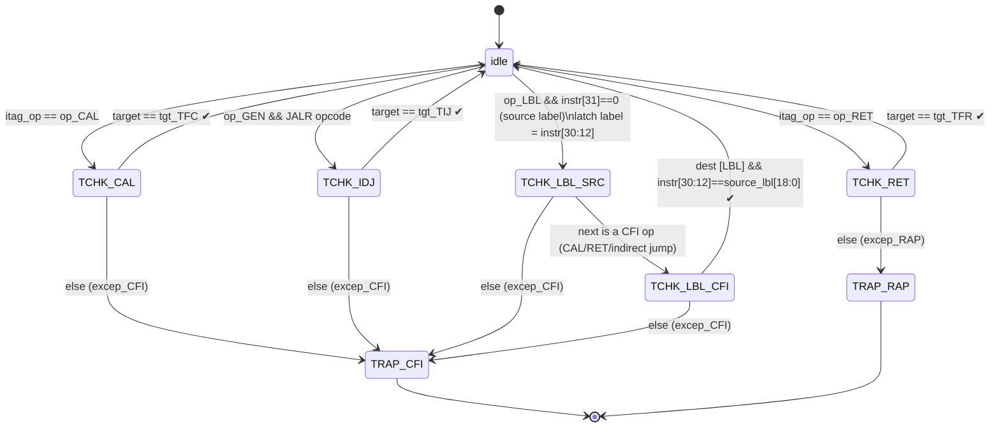
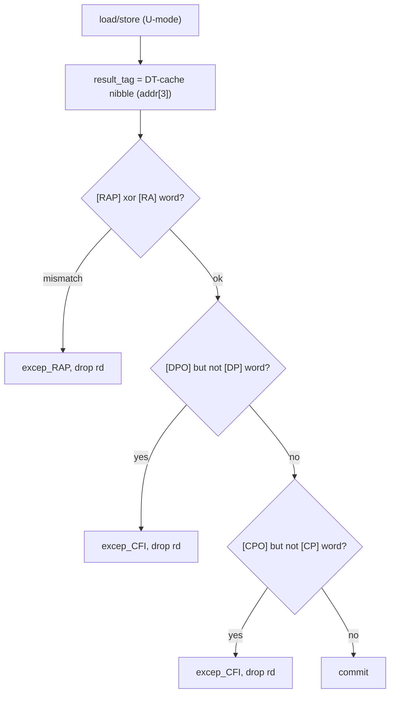
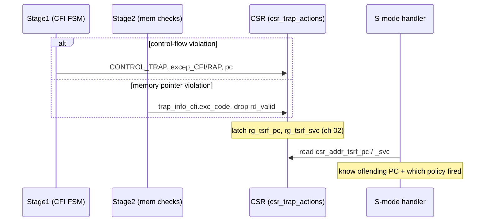

# 07 — CFI State Machine & Pointer-Integrity Checks

This is where the tags become *enforcement*. Two mechanisms:

1. **The Stage-1 CFI state machine** (`CPU_Stage1.bsv`) — a target-check latch that, after
   each control transfer, verifies the *next* instruction is a legally-tagged landing pad.
2. **The Stage-2 memory pointer-integrity checks** (`CPU_Stage2.bsv`) — verify that a
   memory access touches a word whose data tag matches the instruction's tag op.

Both are **U-mode only** and both raise `excep_CFI` / `excep_RAP`
([chapter 02](02-isa-and-tags.md)) via `CONTROL_TRAP`.

---

## 7.1 Reading CFI state into Stage1 (with forwarding)

Before the FSM runs, Stage1 reads the current CFI latch and label from TPRF entry 1,
chaining Stage3-then-Stage2 bypass so the freshest producer wins
(`CPU_Stage1.bsv:157`):

```bsv
let cfi_val = tprf_tag_regfile.read_rs1 (1);                 // CFI status word
match {.busycfia,.rscfia} = fn_tprf_bypass (bypass_tprf_from_stage3, 1, cfi_val);
match {.busycfib,.rscfib} = fn_tprf_bypass (bypass_tprf_from_stage2, 1, rscfia);
rg_cfi = rscfib[2:0];                                         // 3-bit latch

let cfi_lbl = tprf_tag_regfile.read_rs2 (1);                 // label word
match {.busylbla,.rslbla} = fn_lbl_bypass (bypass_lbl_from_stage3, 2, cfi_lbl);
match {.busylblb,.rslblb} = fn_lbl_bypass (bypass_lbl_from_stage2, 2, rslbla);
rg_source_lbl = rslblb[21:3];                                // 19-bit signature
```

`rg_cfi` is the current state; `rg_source_lbl` is the pending label to match.

---

## 7.2 The CFI state machine (`CPU_Stage1.bsv:259`)

The machine arms a check when it sees a control transfer, then validates the landing pad
on the next instruction. All logic is inside `if (rg_stage_input.priv == 0)`.



Reading the states (`ISA_Decls.bsv:518`):

| From state | Sees | Action |
|---|---|---|
| `idle` | `[CAL]` | arm `cfi_TCHK_CAL` |
| `idle` | `[RET]` | arm `cfi_TCHK_RET` |
| `idle` | `[GEN]` + JALR opcode | arm `cfi_TCHK_IDJ` (indirect jump) |
| `idle` | source `[LBL]` (`instr[31]==0`) | arm `cfi_TCHK_LBL_SRC`, capture `cfi_label = instr[30:12]` |
| `cfi_TCHK_CAL` | next `tgt_TFC`? | pass → idle; else `excep_CFI` |
| `cfi_TCHK_RET` | next `tgt_TFR`? | pass → idle; else `excep_RAP` |
| `cfi_TCHK_IDJ` | next `tgt_TIJ`? | pass → idle; else `excep_CFI` |
| `cfi_TCHK_LBL_SRC` | next is a CFI op? | → `cfi_TCHK_LBL_CFI`; else `excep_CFI` |
| `cfi_TCHK_LBL_CFI` | dest `[LBL]` with `instr[30:12] == rg_source_lbl[18:0]`? | pass → idle; else `excep_CFI` |

The label path (`LBL_SRC → LBL_CFI`) is how STAR enforces **type-matched** indirect
transfers: a caller emits a source label with a 19-bit signature, and the destination
must present a matching label. `instr[31]` is the label *type* bit (source vs dest);
`instr[30:12]` is the 19-bit signature.

### Enforcement (commit `6280c1a`, then the `bsc` fix)

The FSM computes `cfi_exec_code` but originally never applied it — violations were
detected and silently dropped. Commit `6280c1a` added enforcement, but wrote the
module-level `alu_outputs` from *inside* the `fv_out` function, which `bsc` rejects
(P0039, non-local assignment). The compiling form (2026-07-04, [chapter 10](10-building.md))
folds the override into function-local effective values that the ALU-output path consumes
(`CPU_Stage1.bsv:326`):

```bsv
// fold the CFI trap override into locals used by the ALU-output path below
Control  eff_control  = alu_outputs.control;
Exc_Code eff_exc_code = alu_outputs.exc_code;
if (cfi_exec_code != 0) begin
   eff_exc_code = cfi_exec_code;
   eff_control  = CONTROL_TRAP;
end
// ... later, the ALU-output path uses eff_control / eff_exc_code:
//   output_stage1.control = eff_control;   trap_info.exc_code = eff_exc_code;
```

Semantics are unchanged from `6280c1a`'s intent — a Stage-1 CFI violation still forces
`CONTROL_TRAP` with `excep_CFI` / `excep_RAP`; only the (illegal) direct write to
`alu_outputs` was replaced.

> **Invariant:** `cfi_exec_code` is non-zero only in U-mode and only on a genuine
> violation (the compiler tags every legal target). This mirrors how an
> illegal-instruction trap sets `CONTROL_TRAP`. Used **in conjunction with the STAR
> compiler** — untagged binaries would trap immediately.

---

## 7.3 Where the CFI latch is committed

The FSM's next state (`cfi_status`) and label are carried as `cfi_tprf` / `cfi_lbl`
through Stage2 to Stage3, and Stage3 commits them to TPRF entry 1 — but **only in
U-mode** (`CPU_Stage3.bsv:206`):

```bsv
if (rg_stage3.rd_valid && instr==LOAD_CONTEXT && funct3==f3_ctx_TPRF)
   tprf_regfile.write_rd (rg_stage3.rd, rg_stage3.rd_val);   // restore path (ch 08)
else if (rg_stage3.priv == 0)
   tprf_regfile.write_rd (1, zeroExtend(tprf_val));          // commit latch to TPRF[1]
```

where `tprf_val` packs the label into `[21:3]` over the status word (`CPU_Stage3.bsv`
near `:101`). In S-mode the latch is *preserved* so a `LOAD_CONTEXT`-restored value is
not clobbered by the kernel/`sret` before the user resumes.

---

## 7.4 Stage-2 memory pointer-integrity checks

In parallel with the data load/store, Stage2 loads the word's data tag from the DT-cache
(nibble-selected by `addr[3]`, [chapter 04](04-dtcache-and-tlb.md)) and checks it against
the instruction's tag op. On a **load** (`CPU_Stage2.bsv:299`):

```bsv
if (rg_stage2.priv == 0 && ostatus == OSTATUS_PIPE && op_stage2 == OP_Stage2_LD) begin
   if ((itag_op(tag) == op_RAP && result_tag != dtag_RA)
    || (itag_op(tag) != op_RAP && result_tag == dtag_RA)) begin
      trap_info_cfi.exc_code   = excep_RAP;      // RA-protection violation
      data_to_stage3.rd_valid  = False;
   end
   else if (itag_op(tag) == op_DPO && result_tag != dtag_DP) begin
      trap_info_cfi.exc_code   = excep_CFI;      // expected a data pointer
      data_to_stage3.rd_valid  = False;
   end
   else if (itag_op(tag) == op_CPO && result_tag != dtag_CP) begin
      trap_info_cfi.exc_code   = excep_CFI;      // expected a code pointer
      data_to_stage3.rd_valid  = False;
   end
   else
      data_to_stage3.rd_valid  = (ostatus1 == OSTATUS_PIPE);
end
```

The symmetric check runs on **stores** (`CPU_Stage2.bsv:467`), against the store value's
tag `val2_tag`.



The `[RAP]` clause is the two-way rule: a `[RAP]` op **must** touch an `[RA]` word, and a
non-`[RAP]` op **must not** — this is what stops a return address from being loaded/forged
through an ordinary load.

> **History / bug fix.** These clauses were joined with `&&` (commit `709344d`), making
> the RAP check always-false and dead; commit `6f67e3e` changed `&&`→`||`, and `3f7c56f`
> fixed the nibble-select so the check reads the *accessed* slot's tag. Both are in the
> 2026 fix layer, which now `bsc`-compiles clean (2026-07-04) — see
> [chapter 10](10-building.md).

---

## 7.5 The two exceptions, end to end



- **`excep_CFI` (16)** — bad call target, bad indirect-jump target, label mismatch,
  forged code/data pointer via load/store.
- **`excep_RAP` (17)** — return doesn't consume `[RA]`, `[GEN]` arithmetic consumes `[RA]`
  ([chapter 06](06-pipeline-integration.md)), or a mem op mismatches an `[RA]` word.

Both funnel into the existing trap path and are localized by the TSRF CSRs
([chapter 02 §2.7](02-isa-and-tags.md)).
