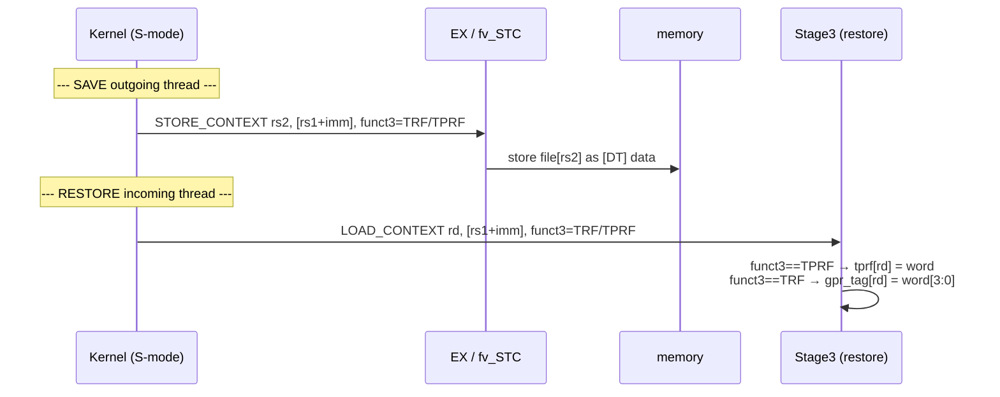
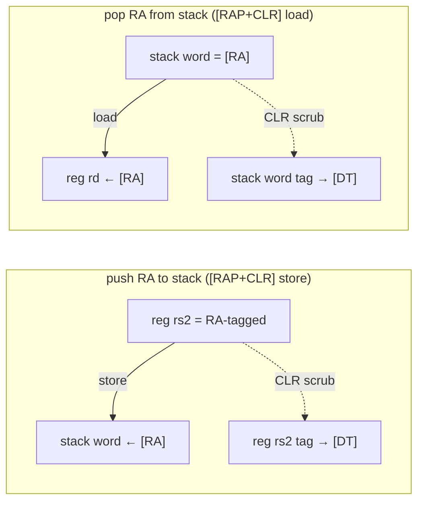

# 08 — Context Switch & the Single-Copy Invariant

Tag state is *per-thread*. When the OS switches processes, it must save and restore that
state, and it must do so **from the kernel**, which runs untagged. This chapter covers
the `STORE_CONTEXT` / `LOAD_CONTEXT` instructions and the `[CLR]` scrub that keeps a
single live copy of one-use tagged values.

Files: `ISA/ISA_Decls.bsv` (opcodes), `CPU/EX_ALU_functions.bsv` (`fv_STC`),
`CPU/CPU_Stage3.bsv` (restore + scrub), `CPU/CPU_Stage2.bsv` (the spare TPRF read port).

---

## 8.1 Why ordinary loads/stores are not enough

The DT-cache tag path is **gated to user mode** (`CPU_Stage2.bsv`, `x.priv==0`
[chapter 07](07-cfi-and-pointer-integrity.md)). So in kernel/S-mode:

- A normal store cannot write a data word's tag into the tag region.
- Therefore data tags do **not** ride with data during a kernel-driven context switch.

Two pieces of tag state must be saved/restored explicitly by the kernel:

| State | File | Why it can't ride with data |
|---|---|---|
| Per-register data tags | TRF (`GPR_TAG_RegFile`) | registers aren't memory; their tags live in the TRF, not the tag region |
| CFI latch + label | TPRF (`TPRF_RegFile`) | this is pipeline/tag-engine state, not data at all |

> **History.** An earlier design assumed data tags would ride with data across a switch;
> commit `8b68a36` corrected this — because the DT path is U-mode gated, the special
> instructions must save/restore **both** the TRF and the TPRF.

---

## 8.2 The instructions

`ISA_Decls.bsv:418–446`. The **funct3 selects the file**:

| funct3 | Selects | `line` |
|---|---|---|
| `f3_ctx_TRF = 000` | a register's 4-bit data tag (TRF) | `:436` |
| `f3_ctx_TPRF = 001` | a TPP-state entry (CFI latch + label) | `:437` |

- **`op_STORE_CONTEXT` (`7'b01_010_11`)** — `mem[rs1+imm] ← file[rs2]`. Saves a TRF or
  TPRF entry to memory (tagged `[DT]` so it round-trips as plain data through the
  U-gated path).
- **`op_LOAD_CONTEXT` (`7'b01_010_10`)** — `file[rd] ← mem[rs1+imm]`. Restores a TRF or
  TPRF entry.

Both are **S-mode-restricted**: `fv_STC`/`fv_LDC` (`EX_ALU_functions.bsv`) trap
`exc_code_ILLEGAL_INSTRUCTION` when `cur_priv < s_Priv_Mode`, so user code cannot
read or reload the tag state the security checks rely on.

To read a TPRF entry for a save without disturbing the pipeline's own TPRF reads, Stage1
uses the **spare TPRF read port** (`read_rs1_port2`, the debugger port) indexed by the
instruction's rs2 field, and carries it as `tprf_val` into Stage2/3 (see
`CPU_Stage1.bsv` around `:170`).



---

## 8.3 The restore path (`CPU_Stage3.bsv`)

Stage3 routes a `LOAD_CONTEXT` to the correct tag file by funct3:

```bsv
// TPRF restore (:205)
if (rd_valid && instr==op_LOAD_CONTEXT && funct3==f3_ctx_TPRF)
   tprf_regfile.write_rd (rd, rd_val);            // restore CFI latch + label
else if (priv == 0)
   tprf_regfile.write_rd (1, zeroExtend(tprf_val)); // else commit the running latch

// TRF restore (:218, in the ISA_F branch)
if (instr==op_LOAD_CONTEXT && funct3==f3_ctx_TRF)
   gpr_tag_regfile.write_rd (rd, rd_val[3:0]);    // restore a register's data tag
```

The `else if (priv == 0)` is the key gating: the **per-instruction CFI-latch commit is
U-mode only**, so a kernel `LOAD_CONTEXT` restore (and the following `sret`) does not
overwrite the value it just restored.

---

## 8.4 The `[CLR]` single-copy invariant

A one-use tagged value (canonically, a **return address** pushed to the stack) must not
remain live in *two* places. `[CLR]` ([chapter 02](02-isa-and-tags.md)) scrubs the source
copy after a move. It is **symmetric**:

| Direction | What is scrubbed | Where | `line` |
|---|---|---|---|
| `[CLR]` on **load** | the **memory** word's tag → `[DT]` | in-cache RMW | `DTCache.bsv:1199` ([ch 04](04-dtcache-and-tlb.md)) |
| `[CLR]` on **store** | the **source register's** TRF tag → `[DT]` | Stage3 | `CPU_Stage3.bsv:225` |

The store-side scrub (`CPU_Stage3.bsv:225`):

```bsv
else if ((rg_stage3.priv == 0) && itag_is_clr (rg_stage3.tag)
         && (rg_stage3.instr[6:0] == op_STORE)) begin
   // [CLR] store: scrub the SOURCE register's TRF tag to [DT]. The stored value
   // (e.g. a return address pushed to the stack) is single-use and must not stay
   // live in the register.
   gpr_tag_regfile.write_rd (instr_rs2 (rg_stage3.instr), dtag_DT);
end
```



So at any instant a genuine return address is tagged `[RA]` in exactly one location — the
register while live, or the stack slot while spilled — never both. An attacker who copies
the spilled value elsewhere gets a `[DT]`-tagged copy that fails the `[RAP]` check on use.

---

## 8.5 Summary

| Mechanism | Instruction / bit | Handler |
|---|---|---|
| Save/restore register data tags | `STORE/LOAD_CONTEXT` + `f3_ctx_TRF` | `fv_STC` / `CPU_Stage3.bsv:218` |
| Save/restore CFI latch + label | `STORE/LOAD_CONTEXT` + `f3_ctx_TPRF` | `fv_STC` / `CPU_Stage3.bsv:205` |
| U-mode-only latch commit | `priv==0` gate | `CPU_Stage3.bsv:207` |
| Scrub source on move (`[CLR]`) | `tag[3]` | load: `DTCache.bsv:1199`; store: `CPU_Stage3.bsv:225` |
