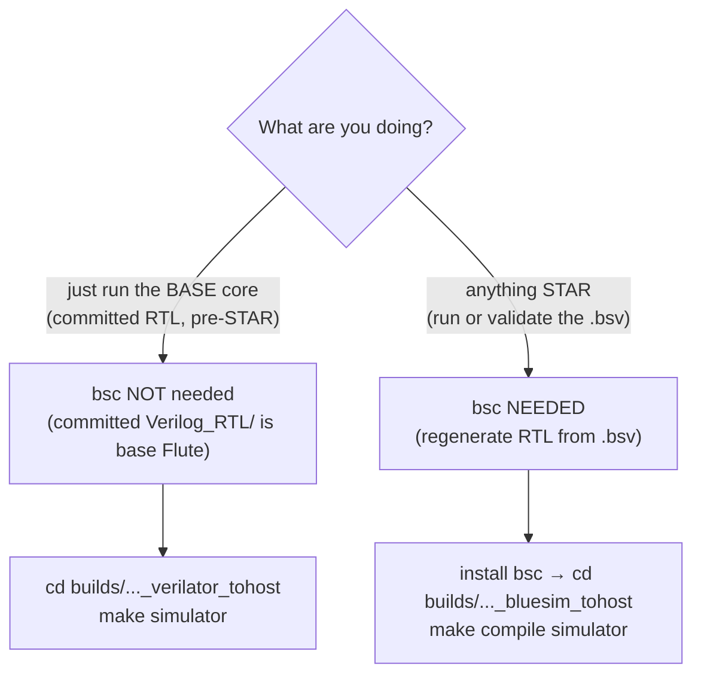

# 10 — Building & `bsc`-Compiling STAR-Flute

Flute (and this STAR fork) is written in **Bluespec SystemVerilog (`.bsv`)**, compiled to
synthesizable Verilog by the free, open-source **`bsc`** compiler. Neither Flute nor this
fork bundles `bsc`; both point to [`github.com/B-Lang-org/bsc`](https://github.com/B-Lang-org/bsc)
(latest release **2026.01**).

This chapter is the recipe to build the core and, importantly, to **`bsc`-compile the STAR
`.bsv` sources** — the step that closes the "source-audited, not yet `bsc`-compiled"
caveat threaded through [chapter 09](09-change-log-by-commit.md).

---

## 10.1 Do you even need `bsc`?



- **Verilator, `bsc` not needed** — each `builds/*_verilator_tohost/` dir ships a committed
  `Verilog_RTL/`. `make simulator` compiles *that committed Verilog*, not the `.bsv`. Fast,
  and needs no `bsc`.
  ✅ **The `RV64GC_MSU_WB_L1_L2` verilator dir's `Verilog_RTL/` now contains STAR** — it was
  regenerated from the current `.bsv` on 2026-07-04 (`bsc` 2026.01) and includes the 6 STAR
  modules (`mkICache`, `mkDTCache`, `mkDT_MMU_Cache`, `mkGPR/FPR_TAG_RegFile`,
  `mkTPRF_RegFile`) plus the tag-threaded base modules. (Before that it was a stale 2021
  snapshot predating STAR entirely.)
  ⚠️ **Committed RTL is a snapshot — it drifts.** After *any* `.bsv` change, re-run
  `make compile` (needs `bsc`) to regenerate `Verilog_RTL/`, or the committed Verilog no
  longer matches the source. When in doubt, use the **Bluesim + `bsc`** path, which always
  builds from the live `.bsv`. Other configs' verilator dirs have *not* been regenerated and
  may still be pre-STAR.
- **`bsc` needed** — to regenerate RTL from the STAR `.bsv` (`make compile`) or build a
  Bluesim sim (`make compile simulator`). **This is the path that actually compiles STAR.**

---

## 10.2 Installing `bsc` on macOS

You have three options, easiest first. **You do not need to build from source** unless you
want a dev build.

### Option A — Homebrew (recommended)

```bash
brew install bsc
```

Ships a **prebuilt bottle** (no GHC/Haskell toolchain): Apple Silicon (Tahoe / Sequoia /
Sonoma) and Intel (Sonoma). Pulls in `gmp`, `icarus-verilog`, `tcl-tk` automatically.
Verify:

```bash
bsc -help
which bsc            # e.g. /opt/homebrew/bin/bsc
```

> `BLUESPECDIR` is **not** needed with 2026.01 — the binary locates its own libraries.

### Option B — prebuilt release tarball (no Homebrew)

Download the asset matching your macOS from the
[2026.01 release](https://github.com/B-Lang-org/bsc/releases):

| macOS | Asset |
|---|---|
| 26 "Tahoe", ARM64 | `bsc-2026.01-macos-26.tar.gz` |
| 15 "Sequoia", ARM64 | `bsc-2026.01-macos-15.tar.gz` |
| 15 "Sequoia", Intel | `bsc-2026.01-macos-15-intel.tar.gz` |
| 14 "Sonoma", ARM64 | `bsc-2026.01-macos-14.tar.gz` |

```bash
tar xzf bsc-2026.01-macos-26.tar.gz
export PATH=$PWD/bsc-2026.01-macos-26/bin:$PATH
bsc -help
```

### Option C — build from source (only if A and B don't fit)

Needs the GHC/Haskell toolchain — this is the "gotcha" step; skip it if a bottle/tarball
works for you.

```bash
xcode-select --install
brew update
brew install autoconf gmp gperf icarus-verilog pkg-config deja-gnu systemc asciidoctor texlive

# GHC + cabal via GHCup, then the Haskell libs bsc needs
curl --proto '=https' --tlsv1.2 -sSf https://get-ghcup.haskell.org | sh
ghcup install ghc 9.6.7           # any 7.10.3–9.12 works; 9.6.7 recommended
cabal update
cabal v1-install regex-compat syb old-time split strict-concurrency

git clone --recursive https://github.com/B-Lang-org/bsc
cd bsc
make GHCJOBS=4                      # binaries land in ./inst/bin
export PATH=$(pwd)/inst/bin:$PATH
bsc -help
```

Verilator/Icarus are also useful downstream; Homebrew: `brew install verilator icarus-verilog`.

---

## 10.3 Building STAR-Flute

The STAR configuration is **RV64GC, M/S/U, WB_L1_L2** — its build directory is
`builds/Flute_RV64GC_MSU_WB_L1_L2_bluesim_tohost/`. Its `Makefile` is auto-generated and
sets `REPO=../..`, `SRC_CORE=$(REPO)/src_Core/Core_v2`, `CACHES=WB_L1_L2`, so a build there
pulls in **exactly the modified STAR `src_Core/`** (ICache, DTCache/DT_MMU_Cache, the tag
regfiles, EX/Stage1/2/3, the ISA layer).

```bash
cd builds/Flute_RV64GC_MSU_WB_L1_L2_bluesim_tohost
make compile simulator     # bsc: .bsv → Verilog_RTL, then build the Bluesim sim
make test                  # run the default ISA test (rv64ui-p-add) with a trace
make isa_tests             # run all ISA tests relevant to this config
```

- `make compile` — `bsc` regenerates `Verilog_RTL/` from the `.bsv`. **This is the command
  that `bsc`-compiles the STAR sources** — any Bluespec type/scheduling error in the STAR
  edits surfaces here.
- `make simulator` — builds the sim executable from the RTL.
- `make clean` / `make full_clean` — clean build products.

### Regenerating the Verilog RTL (for Verilator / FPGA synthesis)

`make compile` in a **`*_verilator_tohost/`** dir runs `bsc -verilog` and writes synthesizable
Verilog into that dir's `Verilog_RTL/`, overwriting the committed snapshot with RTL built
from the current `.bsv`:

```bash
cd builds/Flute_RV64GC_MSU_WB_L1_L2_verilator_tohost
make compile               # bsc -verilog: .bsv -> Verilog_RTL/  (STAR modules included)
make simulator             # build a Verilator sim from that RTL (needs verilator)
```

This is how the committed STAR `Verilog_RTL/` in that dir was produced (2026-07-04). Re-run
it after any `.bsv` edit so the committed Verilog does not drift from the source. Committed
Verilog is a build artifact — treat the `.bsv` as the source of truth.

### Other configurations

To build a different config from scratch:

```bash
cd builds
Resources/mkBuild_Dir.py .. RV64GC MSU WB_L1_L2 bluesim tohost
cd Flute_RV64GC_MSU_WB_L1_L2_bluesim_tohost
make compile simulator test
```

`bsc` compilation flags for this config (from the Makefile): `-D RV64 -D ISA_I -D ISA_M
-D ISA_A -D ISA_C -D ISA_F -D ISA_D -D ISA_PRIV_M -D ISA_PRIV_S -D ISA_PRIV_U -D SV39
-D Near_Mem_Caches -D FABRIC64 -D WATCH_TOHOST` (+ LLCache `CORE_SMALL`, `NUM_CORES=1`,
`CACHE_LARGE`).

---

## 10.4 Compile-order gotchas specific to STAR

If `make compile` fails, these are the STAR-specific things to check first (all documented
per-commit in [chapter 09](09-change-log-by-commit.md)):

1. **The 2026 layer was never `bsc`-built.** Commits from `8aa5e13` onward are
   source-audited only. `d13d3c0` already fixed two compile-breaking regressions from that
   layer (a dropped `csr_addr_medeleg:` case in `CSR_RegFile_MSU.bsv`; a Stage1 label-bypass
   `match` merged onto a comment line). Expect the *possibility* of further such issues —
   fix at the source, rebuild, and update chapter 09's status when it builds clean.
2. **Generated RTL is not source.** `src_SSITH_P2/.../Verilog_RTL/*.v` and `xilinx_ip/`
   are `bsc` output. Never edit them to "fix" a build — edit the `.bsv` and regenerate.
3. **LLCache paths.** WB_L1_L2 needs the `src_LLCache` sub-dirs on the `bsc` path; the
   auto-generated Makefile already sets `CUSTOM_DIRS` for this — use `mkBuild_Dir.py`
   rather than hand-editing paths.

---

## 10.5 Status log — record the result here

Keep this current so the next person knows the real state (this is the single most useful
line in the whole guide):

| Date | `bsc` version | Action | Result | Notes |
|---|---|---|---|---|
| 2026-07-04 | 2026.01 (Homebrew) | `make compile` (bluesim) | **clean (EXIT=0)** | Successful `bsc` build of the full 2026 STAR tree. Required one source fix — see below. |
| 2026-07-04 | 2026.01 (Homebrew) | `make simulator` (bluesim) | **clean (EXIT=0)** | Linked `exe_HW_sim` with all STAR modules. |
| 2026-07-04 | 2026.01 (Homebrew) | `make compile` (verilator) | **clean (EXIT=0)** | Regenerated `Verilog_RTL/` from current `.bsv` — 44 `.v`, incl. the 6 STAR modules; committed. Replaced the stale 2021 pre-STAR snapshot. |

**Clean `bsc` build (2026-07-04).** `make compile` in
`builds/Flute_RV64GC_MSU_WB_L1_L2_bluesim_tohost/` now elaborates the whole design
(`mkTop_HW_Side.ba`), including every STAR module (`mkICache`, `mkDTCache`,
`mkDT_MMU_Cache`, `mkGPR/FPR_TAG_RegFile`, `mkTPRF_RegFile`). Getting there required
**one** source fix in the 2026 layer:

- **`CPU_Stage1.bsv` (P0039)** — the CFI-enforcement block (commit `6280c1a`) assigned the
  module-level `alu_outputs` from *inside* the `fv_out` function, which BSV forbids. Fixed
  by folding the CFI trap override into function-local effective values
  (`eff_control` / `eff_exc_code`) that the ALU-output path then uses. Semantics unchanged:
  a Stage-1 CFI violation still forces `CONTROL_TRAP` with `excep_CFI`/`excep_RAP`.

No other STAR source errors surfaced — the rest of the 2026 layer type-checked and
elaborated as-is. `make simulator` then linked a working Bluesim executable
(`exe_HW_sim`) with every STAR module included.

### 10.5.1 "Compiles" ≠ "validated" — and why stock ISA tests don't apply

A clean `make compile` / `make simulator` proves the STAR RTL **elaborates and builds**.
It does **not** prove the tag policies behave correctly. Two separate things:

- **`make test` / `make isa_tests` use stock `rv64ui-*` binaries — these are NOT valid
  STAR tests.** STAR's checks fire in **user mode** on **tagged** code (inline instruction
  tags + data tags). The standard RISC-V ISA tests are **untagged** and run largely in
  machine mode, so they neither carry the inline tag containers STAR expects nor exercise
  the CFI / pointer-integrity paths. Running them validates the *base* pipeline at best.
- **Proper STAR validation needs STAR-compiler-produced tagged binaries** — programs built
  by the STAR toolchain (COGENT/LLVM) that emit the inline `LUI x0` tag containers and the
  data tags, so the TPP actually has tags to check. Producing/collecting those is a
  separate deliverable; see the dissertation's Ch 6 validation corpus (RIPE / C-Bench /
  microbenchmarks) for what the tagged test suite looks like.

So: the build is green; **behavioral validation is a follow-up that requires the tagged
test binaries, not the stock ISA suite.**

> Toolchain aside: building the `elf_to_hex` test helper needs libelf's `gelf.h`
> (`brew install libelf`). Its checked-in Makefile hardcodes `gcc … -lelf` with no include
> path, so on Homebrew macOS either build it by hand
> (`gcc -I/opt/homebrew/include/libelf … -L/opt/homebrew/lib -lelf`) or add those flags to
> that Makefile. This is a host-setup detail, unrelated to the STAR design.
