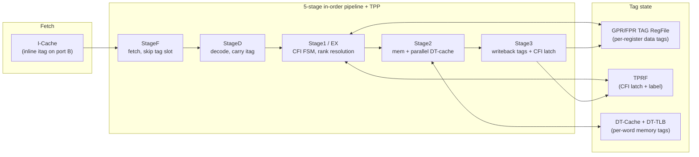
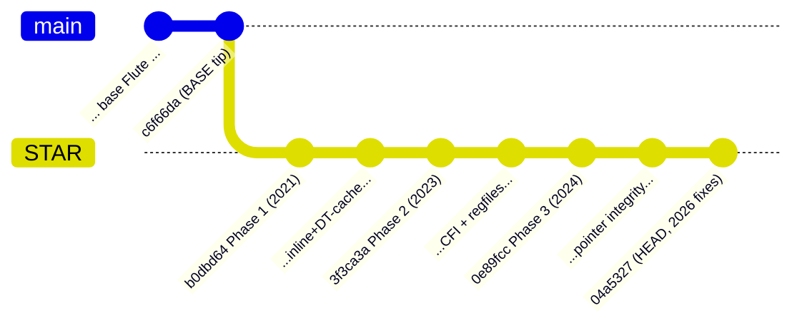

# STAR-Flute — Design & Implementation Guide

A technical reference for the **STAR (Secure Tagged Architecture)** hardware prototype
built on the Flute RISC-V core. It is written for an engineer who has never seen this
code and needs to **continue the work**: it documents the base Flute core, then every
STAR modification, with diagrams, exact `file:line` references, and the current state of
each mechanism.

> This is an engineering document, not the dissertation. Where the two disagree about
> what the *prototype actually does*, **the code (and this doc) win**. Where they
> disagree about the *architecture as designed*, the S&P 2023 paper / dissertation win.

---

## What STAR is, in one paragraph

STAR turns the in-order 5-stage RV64GC Flute core into a **tagged architecture** that
enforces control-flow integrity (CFI) and pointer integrity in hardware. Every
instruction carries a small **inline instruction tag** (fetched alongside it from the
I-cache), and every data word in memory / every register carries a **2-bit data tag**
(DT / DP / CP / RA). A parallel *Tag Processing Pipeline* (TPP), threaded through the
existing pipeline stages, checks these tags: calls must target valid call landing pads,
returns must consume genuine return addresses, pointers cannot be forged from plain
data, and so on. Violations raise two new hardware exceptions (`excep_CFI`,
`excep_RAP`). Scope is **single core, in-order** — no multi-core, OoO, or dynamic
linking.

---

## How to read this guide

Read in order if you are new; jump by subsystem if you are not.

| # | Document | What it covers |
|---|---|---|
| — | **[README.md](README.md)** (this file) | Big picture, repo layout, base↔STAR boundary, glossary |
| 01 | **[01-base-flute.md](01-base-flute.md)** | The base Flute core before STAR: directory tree, the 5-stage pipeline, register files, the WB_L1_L2 cache hierarchy, TLB/PTW |
| 02 | **[02-isa-and-tags.md](02-isa-and-tags.md)** | Tag encodings (instruction + data), the inline tag container, new opcodes, HARD exceptions, TSRF CSRs |
| 03 | **[03-icache-inline-tag.md](03-icache-inline-tag.md)** | How the I-cache reads the inline tag on its 2nd port and how fetch steps over the tag slot |
| 04 | **[04-dtcache-and-tlb.md](04-dtcache-and-tlb.md)** | The Data-Tag Cache, its shared page-table walker, tag-address mapping, `[CLR]` in-cache scrub |
| 05 | **[05-tag-regfiles.md](05-tag-regfiles.md)** | GPR/FPR TAG RegFile (TRF) and TPRF, and how `CPU.bsv` wires them in |
| 06 | **[06-pipeline-integration.md](06-pipeline-integration.md)** | Tag fields in the pipeline structs, bypass/forwarding, rank resolution, tag-address compute |
| 07 | **[07-cfi-and-pointer-integrity.md](07-cfi-and-pointer-integrity.md)** | The Stage-1 CFI state machine and the Stage-2 memory pointer-integrity checks |
| 08 | **[08-context-switch.md](08-context-switch.md)** | Saving/restoring tag state across context switches (`STORE_CONTEXT`/`LOAD_CONTEXT`), `[CLR]` scrub |
| 09 | **[09-change-log-by-commit.md](09-change-log-by-commit.md)** | Every STAR commit, grouped into the three development phases, with a file→commit cross-reference |
| 10 | **[10-building.md](10-building.md)** | Installing `bsc` (Homebrew / prebuilt / source) and building + `bsc`-compiling the STAR sources |

Diagrams are [Mermaid](https://mermaid.js.org/); GitHub renders them inline. For the
*base* machine we reuse the base-Flute authors' authoritative drawings in
[`../Microarchitecture/Figures/`](../Microarchitecture/Figures/) (`Fig_100`…`Fig_600`)
rather than redrawing them — chapters [01](01-base-flute.md) and
[04](04-dtcache-and-tlb.md) link the relevant ones and annotate where STAR hooks in.

---

## Repository layout & the base ↔ STAR boundary

STAR is layered on the mainline **Flute** core (Bluespec SystemVerilog). The base ends at
commit **`c6f66da`**; the **59 commits after it are STAR**, all authored by
`Whiskeyjac` / `rgollap1` / `ravitheg`, from `b0dbd64` (2021-07-20) to `04a5327` (HEAD).

The STAR source footprint is **6 new `.bsv` files + ~20 modified**, roughly **+5,400
lines** of `.bsv`. (The much larger churn you see in `git diff --stat` is
`bsc`-generated Verilog under `src_SSITH_P2/…/Verilog_RTL/` and `xilinx_ip/` — **build
artifacts, not design**. Never document those `mk*.v` files as source.)

### The 6 new STAR files

| File (under `src_Core/`) | Role | Doc |
|---|---|---|
| `Near_Mem_VM_WB_L1_L2/ICache.bsv` | I-cache that reads the inline instruction tag on a 2nd BRAM port | [03](03-icache-inline-tag.md) |
| `Near_Mem_VM_WB_L1_L2/DTCache.bsv` | Data-Tag Cache — holds per-word 2-bit data tags | [04](04-dtcache-and-tlb.md) |
| `Near_Mem_VM_WB_L1_L2/DT_MMU_Cache.bsv` | DT-cache MMU wrapper (delegates page walks to the D-cache) | [04](04-dtcache-and-tlb.md) |
| `RegFiles/GPR_TAG_RegFile.bsv` | Integer Tag Register File (TRF) — 4-bit tag per GPR | [05](05-tag-regfiles.md) |
| `RegFiles/FPR_TAG_RegFile.bsv` | FP Tag Register File | [05](05-tag-regfiles.md) |
| `RegFiles/TPRF_RegFile.bsv` | TPP State Register File (TSRF) — CFI latch + label | [05](05-tag-regfiles.md) |

### The main modified base files

- **Fetch/predict**: `CPU/CPU_StageF.bsv`, `CPU/CPU_StageD.bsv`, `CPU/Branch_Predictor.bsv`
- **Pipeline plumbing**: `CPU/CPU_Globals.bsv` (tag fields + bypass structs), `CPU/CPU.bsv` (instantiation)
- **Policy logic**: `CPU/EX_ALU_functions.bsv` (rank resolution, tag-addr, per-tag policy), `CPU/CPU_Stage1.bsv` (CFI FSM), `CPU/CPU_Stage2.bsv` (memory checks), `CPU/CPU_Stage3.bsv` (writeback)
- **Cache wiring**: `Near_Mem_VM_WB_L1_L2/{D_MMU_Cache,I_MMU_Cache,PTW,Near_Mem_Caches,Near_Mem_IFC,MMIO_AXI4_Adapter}.bsv`, `src_LLCache/LLCache_Aux.bsv`
- **ISA/CSRs**: `ISA/ISA_Decls.bsv`, `ISA/ISA_Decls_Priv_M.bsv`, `ISA/ISA_Decls_Priv_S.bsv`, `RegFiles/CSR_RegFile_MSU.bsv`

> **Active configuration.** STAR uses the **`Near_Mem_VM_WB_L1_L2`** near-memory variant
> (write-back L1 I/D + shared L2). The `Near_Mem_VM_WB_L1` and `Near_Mem_VM_WT_L1`
> trees exist in the repo but are **not** the STAR target — STAR's new files live only
> under `Near_Mem_VM_WB_L1_L2`.

---

## Build & verification status — read before you trust a mechanism

STAR development happened in three phases separated by ~2-year gaps, plus a **2026
source-audit / spec-alignment layer**:

1. **Phase 1 (2021)** — inline tagging + data-tag memory path.
2. **Phase 2 (2023)** — control-flow integrity + the tag register files.
3. **Phase 3 (2024)** — pointer integrity + finalization.
4. **2026 fixes** — rank-order correction, dead-check fixes, structured tag encoding,
   in-cache `[CLR]` scrub, TSRF CSRs, context-switch re-targeting, Stage-1 trap
   enforcement, doc comments, 19-bit label widen.

✅ **As of 2026-07-04 the full 2026 STAR tree `bsc`-compiles clean** (`make compile`,
`bsc` 2026.01, `EXIT=0`, `mkTop_HW_Side.ba` elaborated — all STAR modules included).
Reaching a clean build required **one** source fix (`CPU_Stage1.bsv` P0039 — a non-local
`alu_outputs` assignment in the CFI-enforcement block; fixed semantics-preservingly). See
[10-building.md](10-building.md) for the recipe + status log and
[09-change-log-by-commit.md](09-change-log-by-commit.md) for per-commit detail.

Note this confirms the design **compiles and links** (`make simulator` produced a working
`exe_HW_sim`); it does **not** mean the tag policies are behaviorally validated. Stock
`rv64ui-*` ISA tests do **not** validate STAR — they are untagged and run in machine mode,
so they never exercise the user-mode tag checks. Real validation needs
**STAR-compiler-produced tagged binaries**; see [10-building.md §10.5.1](10-building.md).

---

## Glossary

| Term | Meaning |
|---|---|
| **STAR** | Secure Tagged Architecture — the security mechanism this repo implements |
| **TPP** | Tag Processing Pipeline — the tag-checking logic threaded through the 5 stages |
| **Instruction tag / itag** | 8-bit field (6 meaningful bits) fetched inline with each instruction: `op[2:0]`, `CLR[3]`, `target[5:4]` |
| **Data tag / dtag** | 2-bit tag per 32-bit word; `DT`=plain data, `DP`=data pointer, `CP`=code pointer, `RA`=return address. Stored 4-bit (two words) per register/nibble |
| **TRF** | Tag Register File — shadow of the GPR/FPR files holding each register's data tag (`GPR_TAG_RegFile` / `FPR_TAG_RegFile`) |
| **TPRF / TSRF** | TPP State Register File — holds the CFI target-check latch + the active function label/signature (`TPRF_RegFile`) |
| **DT-Cache / DT-TLB** | Data-Tag Cache and its TLB — a third L1 cache holding the per-word memory tags |
| **Rank** | Ordering of data tags `DT(0) < DP(1) < CP(2) < RA(3)`; encoding value equals rank |
| **Landing pad / target tag** | `TFC`/`TFR`/`TIJ` — a tag marking a legal target of a call / return / indirect jump |
| **`[CLR]`** | "clear/scrub" modifier bit — enforces the single-copy invariant by wiping a tag after a move |
| **`excep_CFI` / `excep_RAP`** | The two STAR HARD exceptions: CFI/label violation (16) and return-address-protection violation (17) |
| **CFI latch** | The 3-bit `cfi_TCHK_*` state armed by a control-transfer instruction, checked on the next instruction |
